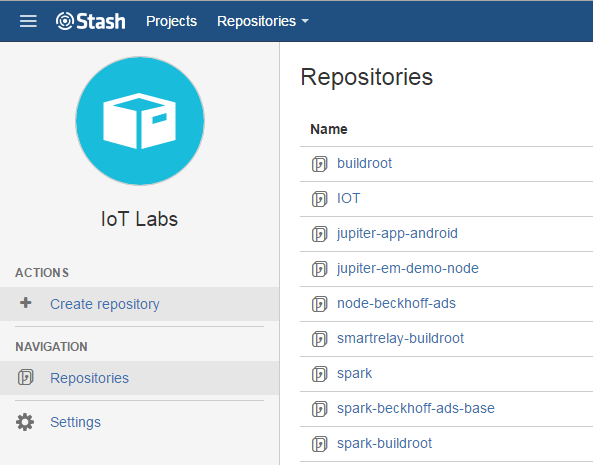
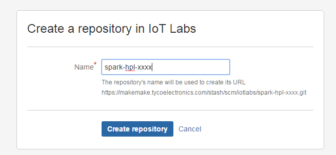
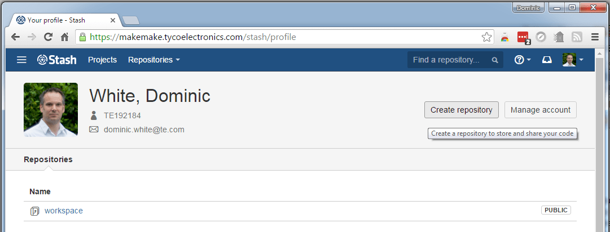
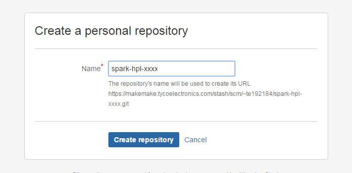
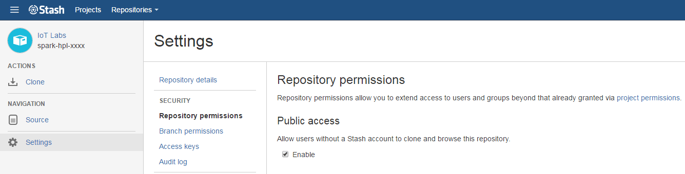
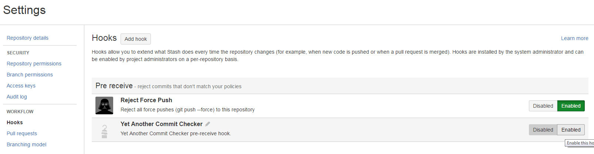
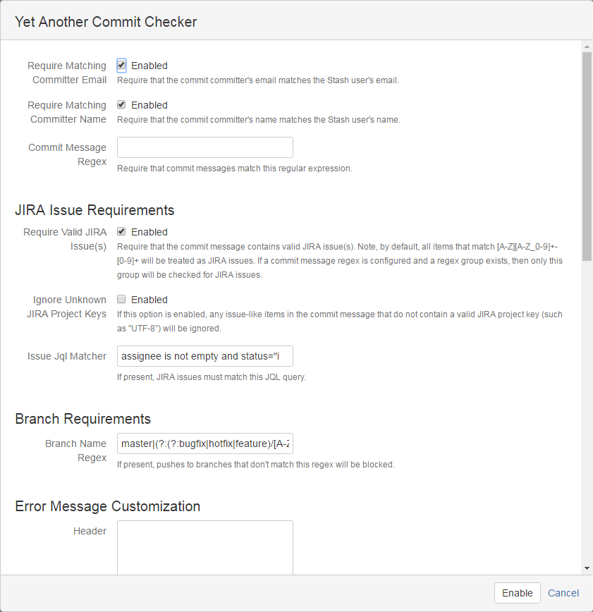
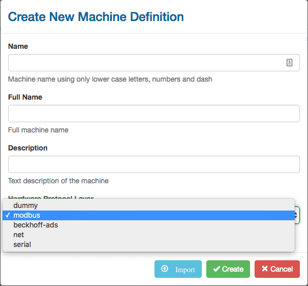
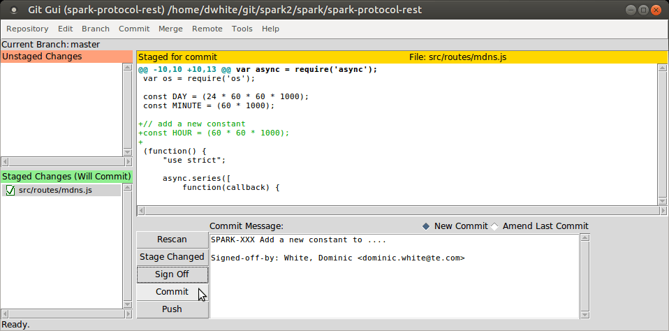

# Adding A Hardware Protocol Layer
<!-- The table of contents is auto generated, do not edit the following section by hand -->

<!-- toc -->

- [Prerequisite Skills](#prerequisite-skills)
- [Integration of non Javascript code into the HPL.](#integration-of-non-javascript-code-into-the-hpl)
- [Create a new Git Repository for the HPL](#create-a-new-git-repository-for-the-hpl)
- [Files Required for the new HPL Module](#files-required-for-the-new-hpl-module)
- [Initial Repository Commit](#initial-repository-commit)
- [Additional Steps to get a new HPL Module Integrated into the Spark Framework](#additional-steps-to-get-a-new-hpl-module-integrated-into-the-spark-framework)
- [Testing Spark with the new HPL](#testing-spark-with-the-new-hpl)
- [Committing Everything Back to Stash](#committing-everything-back-to-stash)

<!-- tocstop -->

The aim of this document is to show how to create a new Hardware Protocol Layer (HPL) that can be used as a base to create new machines based on the protocol supported by the new HPL. The HPL's job is to interface to the desired protocol's APIs, to extract data from the protocol and provide it to Spark's database on a regular basis. The data extracted is described by the variables configured by the machine's JSON configuration file, created either by hand or via the WebAdmin's Machine Definition Editor.

The HPL should be written in a generic way so that it may be used by any machine that conforms to the specific protocol being wrapped. Adding to the HPL's configuration settings should be utilized to help achieve this flexibility.

This document also shows how to add to and update Spark's git repositories held in the [IoT Labs](https://makemake.tycoelectronics.com/stash/projects/IOTLABS) area of Stash. If you do not have write access to this area it is possible to still commit your new code to your personal area of Stash.

## Prerequisite Skills

This document is aimed at experienced software developers with a good understanding of Linux, Node.js and Javascript. If these skills are not available then it would be advisable to start by following some Javascript and Node.js training. A good place to start is the [NodeSchool](http://nodeschool.io/) website. At a minimum the following classes should be completed:

  * [Basic Javascript](https://www.github.com/sethvincent/javascripting)
  * [Basic Node.js](https://github.com/workshopper/learnyounode)
  * [Node Package Manager](https://github.com/npm/how-to-npm)
  * [ASync](https://github.com/bulkan/async-you)

## Integration of non Javascript code into the HPL.

This document details how to integrate a new HPL layer based on an existing Node.js module supporting the underlying protocol. If the protocol is implemented in a different language such as C or C++ then additional development is required which beyond the scope of this document. Packages such as [Node-gyp](https://github.com/nodejs/node-gyp) can be used to enable the integration of C libraries into a Node.js module. There is a training module [here](https://github.com/workshopper/goingnative) which gives some guidance on how the process works. A working example can be found in the [Beckhoff ADS](https://makemake.tycoelectronics.com/stash/projects/IOTLABS/repos/node-beckhoff-ads/browse) implementation of Spark.

## Create a new Git Repository for the HPL
The first task is to create a new git repository within the [IoT Labs](https://makemake.tycoelectronics.com/stash/projects/IOTLABS) area of Stash. This needs to observe the following naming convention.
__spark-hpl-xxxx__ where __xxxx__ is the new protocol name e.g. __spark-hpl-modbus__

Create Repository Step 1  |  Create Repository Step 2
------------ | -------------
 | 

If you do not have permission to create a repository within the IoT Labs area of Stash then you can create a new repository in your personal area in [Stash](https://makemake.tycoelectronics.com/stash/profile).

Create Personal Repository Step 1  |  Create Personal Repository Step 2
------------ | -------------
 | 

## Files Required for the new HPL Module

Create a new directory of the same name in the Spark project directory (if there is currently no Spark repository cloned, then the instructions in the _Getting a Spark Development Environment Setup on a Linux Virtual Machine_ document can be used to create one).

```
$ mkdir ~/git/spark/spark-hpl-xxxx
$ cd ~/git/spark/spark-hpl-xxxx
```

Now in this directory there needs to be the following files.

### 1) .gitignore

A special file that git uses to ignore certain build or temporary files that should not be added to the repository. This can be copied from an existing HPL.

### 2) package.json

A file describing the module and its dependencies. This can be copied from an existing HPL, but the HPL's name will need to be updated accordingly (including the git repository url). It is also important to ensure any dependencies used in the main javascript file are included in this file, and at the intended version.

In this Modbus HPL example the module specifically uses _modbus-serial_ and _serialport_. The other dependencies, _async_ and _lodash_ are required by all HPL frameworks.

Note, the names as given from [npmjs](https://www.npmjs.com) are used, as they may differ from their git repository names. e.g. in this case _serialport_ is used and not _node-serialport_.

```javascript
{
    "name": "spark-hpl-modbus",
    "fullname": "Modbus HPL",
    "version": "0.0.1",
    "description": "Spark HPL for Modbus",
    "private": true,
    "main": "index.js",
    "repository": {
        "type": "git",
        "url": "https://makemake.tycoelectronics.com/stash/scm/iotlabs/spark-hpl-modbus.git"
    },
    "keywords": [
        "Spark"
    ],
    "author": {
        "name": "Martin Bark",
        "email": "martin.bark@te.com"
    },
    "dependencies": {
        "async": "2.0.0-rc.4",
        "lodash": "4.12.0",
        "modbus-serial": "4.1.0",
        "serialport": "3.1.2-beta1"
    }
}
```

This file can be added to as dependencies are required by the HPL as it develops.

### 3) defaults.json

This file details the configuration settings required for the HPL. This is used to create the machines config database entry and is used by the WebAdmin in how it shows the configuration options for any machine derived from this HPL.

The configuration settings added are ones that are deemed necessary by the underlying protocol. At the bare minimum there needs to be an _enable_ setting to allow any machine created from the HPL to be turned on and off.

It is split into the following three sections for _model_, _schema_, and _form_.

The _model_ section is used to define the storage elements for the config items, and allows initial defaults to be written to the database (although any of these defaults can be overwritten by the defaults added when making a particular machine profile). Below is an example from the Modbus HPL.

```javascript
"model": {
	"enable": false,
	"requestFrequency": 10,
	"slaveId": 1,
	"highByteFirst": true,
	"highWordFirst": false,
	"interface": "serial",
	"mode": "RTU",
	"device": "/dev/ttyUSB0",
	"baudRate": "115200",
	"ipAddress": ""
},
```

The _schema_ section details the name, description, storage type and range of each of the configuration settings. The type can be boolean, integer, or string.

Here is an example of a integer type that is used to set a request update frequency for a protocol. The user input in this case will be bounded by the optional _minimum_ and _maximum_ properties.

```javascript
"requestFrequency": {
	"title": "Time between Requests (in seconds)",
	"description": "The time to wait between each complete set of requests.",
	"type": "integer",
	"minimum": 2,
	"maximum": 120
},
```

Strings can be bounded by either adding an enumerated list of possibilities for the string. This will cause a drop down list to be used rather than a freeform text box.

```javascript
"baudRate": {
	"title": "Serial Baud Rate",
	"description": "Choose the Baud Rate for the serial device.",
	"type": "string",
	"enum": ["75", "110", "300", "1200", "2400", "4800", "9600", "19200", "38400", "57600", "115200"]
},
```

Or limited by whether they match a specific Regular Expression (REGEX) pattern. In this case the REGEX describes how to allow only valid ip addresses as inputs.

```javascript
"ipAddress": {
	"title": "Modbus slave's IP Address",
	"description": "The IP address of the Modbus slave device.",
	"type": "string",
	"pattern": "^(?:(?:25[0-5]|2[0-4][0-9]|[01]?[0-9][0-9]?)\\.){3}(?:25[0-5]|2[0-4][0-9]|[01]?[0-9][0-9]?)$",
	"validationMessage": "Must be a valid IPv4 address"
}
```

The schema section also states which of the configuration items are required to be set, as some may be optional.

The _form_ section is used for how it appears on the screen in the WebAdmin i.e. its order. It also allows some logic to hide/show config options based on other config options. For example only show an _ipAddress_ option if configured in _ethernet_ mode, and only show _baudRate_ if configured in _serial_ mode as given in the example below.

```javascript
"form": [
	"enable",
	"requestFrequency",
	"slaveId",
	"highByteFirst",
	"highWordFirst",
	"interface",
	{
		"condition": "model.interface=='serial'",
		"key": "baudRate"
	},
	{
		"condition": "model.interface=='ethernet'",
		"key": "ipAddress",
		"placeholder": "192.168.0.1"
	}
]
```

A simple version from _spark-hpl-dummy_ can be used and added to as required.

### 4) schema.json

This file is mainly to describe what properties each variable in this HPL requires in addition to the base ones like _name_, _description_ and _format_.
For example in the Modbus HPL schema we have added a _type_ property to distinguish the different areas of memory to read from e.g. coil or holding register, it is defined as an enum.

```javascript
"type": {
	"title": "Type",
	"description": "The type of data being accessed, discrete input(di), coil, input register (ir), or holding register (hr)",
	"type": "string",
	"enum": [
		"di",
		"coil",
		"ir",
		"hr"
	]
},
```

Continuing the Modbus example, we also use an _address_ property to store the address that needs to be passed to the Modbus protocol to extract the required variable. In this case it needs to be a 4 digit hex value as a string, a REGEX 'pattern' is used to make sure the input conforms to this (this will be used by the WebAdmin's machine editor when attempting to create new variables for a machine).

```javascript
"address": {
	"title": "Address",
	"description": "4 hex digit modbus address",
	"type": "string",
	"minLength": 4,
	"maxLength": 4,
	"pattern": "^[a-fA-F0-9]{4}$"
}
```

Again this file should evolve as the HPL develops.

### 5) index.js

This is the main javascript file used to interface between the Spark framework and the protocol API being wrapped by this HPL.

#### Base Framework
The following framework can be used as a starting point. The framework makes calls out to helper _open_ and _close_ functions which will be detailed later.

```javascript
// mandatory 'requires' to conform to the Spark HPL framework
var path = require('path');
var _ = require('lodash');
var defaults = require(path.join(__dirname, 'defaults.json'));
var schema = require(path.join(__dirname, 'schema.json'));

// additional 'requires' for the underlying protocol used and any helper modules
var ModbusRTU = require("modbus-serial");
var async = require('async');

// constructor (set suitable name based on HPL's purpose)
var hplModbus = function(log, machine, model) {

    //Private variables
    var that = this;	// store a pointer to our context
    var timer = null;	// used as a repeat timer to trigger request cycles to the protocol every n seconds
    var client = null;	// pointer to object returned by the protocol we are wrapping

    //public variables
    that.dataCb = null;
    that.machine = _.merge({}, defaults, machine, {
        settings: {
            model: model
        }
    });

    //private methods
	// place any additional helper functions here

	//Privileged methods
    this.start = function(dataCb, done) {
        if (!that.machine) {
            return done("machine undefined");
        }

		// check we have been passed a function to allow us to write database objects back
        if (typeof dataCb !== "function") {
            return done("dataCb not a function");
        }
        that.dataCb = dataCb;

        //check if the machine is enabled
        if (!that.machine.settings.model.enable) {
            log.debug(that.machine.info.name + ' Disabled');
            return done(null);
        }

		// call our 'open' helper function to open/start our protocols interface
        open(function(err){
            if(err) {
                return done(err);
            }

            log.info('Started');
            return done(null);
        });
    };

    this.stop = function(done) {
        if (!that.machine) {
            return done("machine undefined");
        }

        // if the protocol has been open/created (here our device was called 'client')
        if ( client ) {

			// close the device using our helper function
            close( function(err) {
                if(err) {
                    log.error(err);
                }
                client = null;
                log.info('Stopped');
                return done(null);
            });
        } else {
            log.info('Stopped');
            return done(null);
        }
    };

    this.restart = function(done) {
        log.debug("Restarting");
        that.stop(function(err) {
            if (err) return done(err);
            that.start(that.dataCb, function(err) {
                return done(err);
            });
        });
    };

    this.updateModel = function(model, done) {
        that.machine.settings.model = _.cloneDeep(model);
        that.restart(function(err) {
            return done(err);
        });
    };

    return true;
};

module.exports = {
    hpl: hplModbus,  // set this to match the constructor's name
    defaults: defaults,
    schema: schema
}
```

Once the framework is in place the _open_ and _close_ functions should be added.

#### Open Function
The _open_ function has the main responsibility of configuring and opening the underlying protocol. It can also be used to initiate a 'tick' timer task that can be used to trigger transactions with the underlying protocol at regular intervals e.g. to request data as included in the example here.

```javascript
function open(callback) {

	// extract necessary configuration items to allow us to configure the underlying protocol
	var requestFrequencyMs = that.machine.settings.model.requestFrequency * 1000;
	var path = that.machine.settings.model.device;
	var baudRate = parseInt(that.machine.settings.model.baudRate, 10);
	var slaveId = that.machine.settings.model.slaveId;
	var numDatabits = 8;

	// this protocol requires instantiating first
	client = new ModbusRTU();

	// call the protocol's 'connect' / 'open' related methods passing in any necessary configuration set
	// in this case the function is asynchronous, so we continue with what we need to do afterwards within
	// the function's callback parameter
	client.connectRTUBuffered(path, {baudRate: baudRate, databits: numDatabits}, function(err) {
		if (err) {
			log.error(err);
			return callback(null);
		}
		client.setID(slaveId);

		// if the protocol is of the request/response style then set up a repeat timer task that will call a function at
		// regular intervals so we can call the 'request/get data' API of the underlying protocol
		timer = setInterval(readTimer, requestFrequencyMs);

		callback(null);
	});
}
```

If the protocol requires any 'one time' subscribing of variables, then this function would also be the place to do it. Looping through the variable array accessible by _that.machine.variables_ might be a useful way of doing this. For example here, the variable might contain an 'address' property that could be used to pass to a protocol's subscribe function.

```javascript
// point to the stored variable list
var variables = that.machine.variables;
// loop through this list..
for(var i=0; i<variables.length; i++) {
	// calling a subscribe function for each variables 'address'
	client.subscribeFunction(variables[i].address);
}
```

If the protocol needs to emit signals when it has data ready, then the setting up of this mechanism should also happen in this open function. For example if one was using the Node.js _net_ module directly to create a client connection to a TCP server it would need something like the following:

```javascript
// try and connect to server
client = net.createConnection(port, host, function() {
	// successfully connected to server
	// trigger callback on successful connection to server
	callback(null);
});

// subscribe to on 'data' events
client.on('data', function(data) {
	// got data from server, pass string version to our process helper function
	processPublishedData(data.toString().trim());
});
```

#### Close Function
The _close_ function is responsible for closing / un-initializing the underlying protocol and anything else that needs stopping e.g. if a timer task had been previously setup.

```javascript
function close(callback) {
    // close the interface

	// if a repeating timer task was setup in the open function (for the purpose of triggering requests to the protocol) then it should be cancelled here
	// if not, remove this code
    if (timer) {
        clearInterval(timer);
        timer = null;
    }

	// call any close function necessary from the protocol's API being using and then execute the provided callback.
	// if the close function is asynchronous then pass the callback provided to it
	// e.g.
	client.closeFunction(callback);
	// or if synchronous then do this instead
	client.closeFunction();
	callback();
}
```

The close function can be called at anytime (triggered by a config change in the WebAdmin) so it may be advantageous to hold off closing the underlying protocol if part way through a request or sequence of requests to the protocol. If this is the case a flag can be used to indicate a 'busy' state, the close function could hold off and periodically check the busy flag is clear before closing. The flag would need setting and clearing correctly in the request portion of code.  In this example the protocol's asynchronous close function is held off from being called until a _sendingActive_ flag is cleared, or a certain timeout is reached.

```javascript
// if we are currently in a request/response cycle
if(sendingActive === true) {
	// hold off on closing using an interval timer
	var waitCounter = 0;
	var activeWait = setInterval(function() {
		// until safe to do so, or we have waited too long
		if ((sendingActive === false) || (waitCounter > 20)) {
			clearInterval(activeWait);
			client.closeFunction(callback);
		}
		waitCounter++;
	}, 100); // interval set at 100 milliseconds
} else {
	// otherwise close immediately
	client.closeFunction(callback);
}
```

#### Timer Function for Request/Response Example

In this request/response style example, a _readTimer_ function (triggered due to the use of _setInterval_ in the _open_ function) is used to

1. Use the _variables_ object array to request the latest values of the variables from the protocol's API achieved through the _readAll_ helper function.
2. Pass the returned _dataArray_ object containing each variables latest value to a _storeAll_ helper function which stores each variables value correctly in the database.

```javascript

function readTimer() {

    // read the latest data from each of the variables given in the config file
    readAll(that.machine.variables, function(err1, dataArray) {
        if (err1) {
            log.error(err1);
            return;
        }

        // once we have all the data back in an array store each result in the database
        storeAll(dataArray, function(err2) {
            if (err2) {
                log.error(err2);
            }
        });
    });
}
```

Here is an example of a simplified _readAll_ helper function used in the Modbus HPL. It utilizes the [async](https://github.com/caolan/async) library to neatly loop through the array of variables in turn, allowing the asynchronous request function to be called in turn for each variable in the list. Note, that in this case the _type_ property of each variable is used to determine which of the Modbus API's are used to read the data. In conjunction with this, certain machine setting properties are also used e.g. to determine the endianess the data was expected to be sent in.

A final function is called when the array has been exhausted, which gives the opportunity to call the provided _done_ callback to return to the timer function.

```javascript

function readAll(variableArray, done) {

    sendingActive = true;
    // object to store results before writing each to database
    var resultsArray = {};

    // iterate through each variable given in the config file
    async.forEachOfSeries(variableArray, function (item, index, callback) {
        // read data over modbus based on variable type
        switch (item.type) {
            case 'di':    // discrete inputs
            client.readDiscreteInputs(item.address.charCodeAt(0), 1, function(err, modbusData) {
                if(err) {
                    resultsArray[index] = null;
                    callback(err);
                    return;
                }
                // get data ready for database (assume length of 1 for discrete inputs)
                resultsArray[index] = modbusData.data[0];
                // move onto next item
                callback();
            });
            break;
            case 'coil':  // output coils
            client.readCoils(item.address.charCodeAt(0), 1, function(err, modbusData) {
                if(err) {
                    resultsArray[index] = null;
                    callback(err);
                    return;
                }
                // get data ready for database (assume length of 1 for discrete inputs)
                resultsArray[index] = modbusData.data[0];
                // move onto next item
                callback();
            });
            break;
            case 'hr':    // holding registers

            // 16bit (or more if bonded) so look at format property to see what length we need to get
            var length;
            if (item.format  === 'Int') {
                length = 1;
            } else if (item.format  === 'Int2') {
                length = 2;
            }
            // read the holding register for the correct length
            client.readHoldingRegisters (item.address.charCodeAt(0), length, function(err, modbusData) {
                if(err) {
                    resultsArray[index] = null;
                    callback(err);
                    return;
                }
                // get data ready for database based on the format returned)
                if (item.format  === 'Int') {
                    // check byte ordering before extracting the 16bit data
                    if(that.machine.settings.model.highByteFirst === true) {
                        resultsArray[index] = modbusData.buffer.readInt16BE(0);
                    } else {
                        resultsArray[index] = modbusData.buffer.readInt16LE(0);
                    }
                } else if (item.format  === 'Int2') {
                    // 32 bit data, need to check byte and word ordering
                    if(that.machine.settings.model.highByteFirst === true) {
                        if( that.machine.settings.model.highWordFirst === true ) {
                            resultsArray[index] = modbusData.buffer.readInt32BE(0);
                        } else {
                            resultsArray[index] = (modbusData.buffer.readInt16BE(2) << 16) + modbusData.buffer.readUInt16BE(0);
                        }
                    } else {
                        if( that.machine.settings.model.highWordFirst === false ) {
                            resultsArray[index] = modbusData.buffer.readInt32LE(0);
                        } else {
                            resultsArray[index] = (modbusData.buffer.readInt16LE(0) << 16) + modbusData.buffer.readUInt16LE(2);
                        }
                    }
                }
                // move onto next variable in the list
                callback();
            });
            break;
            default:
            // undefined type, move onto next variable in the list
            resultsArray[index] = null;
            callback();
            break;
        }

    }, function (err) {
        // call the callback
        done(err, resultsArray);
    });
}

```

Here is an example of a  _storeAll_ helper function used in the Modbus HPL, again it utilizes the _async_ libraries _forEachOfSeries_ function to work through a list of items. The HPL framework provides the _dataCb_ which is how the results are written back to Spark's database. In this instance the results are in the correct format so are passed straight to the database. For other protocols all results could be returned as strings, so it may be necessary to use the _that.machine.variables[index].format_ property to get information on any format transitioning that was required. See the publish example later on in this document.

Again a final function is called when the array has been exhausted, this is where a flag indicating requests are still happening is cleared and the _done_ callback is then called.

```javascript
function storeAll(dataArray, done) {

    // process the array of results
    async.forEachOfSeries(dataArray, function(dataItem, index, callback) {
        // if there wasn't a result
        if (dataItem === null) {
            // highlight that there was an error getting this variables data
            log.error("Failed to get data for variable " + that.machine.variables[index].name);
            // and just move onto next item
            return callback();
        }

        // otherwise update the database for this variable
        that.dataCb(that.machine, that.machine.variables[index], dataItem, function(err, res) {
            if (err) {
                log.error(err);
            }
            // move onto next item once stored in db
            callback();
        });
    }, function (err) {
        // update the busy flag now we have finished
        sendingActive = false;
        // and call the callback
        done(err, resultsArray);
    });
}
```

#### Request/Response Optimizations
It should be noted that this is just one way to implement requesting and storing data. It could easily be done by storing each data response into the database before moving on to the next variable request. In the case of the Modbus HPL it was done this way because we wanted to then optimize the amount of requests we did. With the Modbus protocol, if data is being read from sequential addresses, then instead of a request/response call for each piece of data, they can be combined into single requests of length _n_, where _n_ is the number of sequential data items.

This requires a small amount of pre-processing before the requests are made, and some post-processing to get back to the correct number of variable items to store, but it can result in far fewer potentially very slow asynchronous transactions occurring over the interface to the external machine.

This should definitely be a consideration when creating new HPLs that use request/response type operations, especially if the interface to the physical machine uses a serial port. If on the other hand all data is given back from the protocol in a single response, optimizations like this would not be necessary.

#### Publish Example

If the HPL being created is connecting to a machine that just publishes data, it may not need to use a timer to request data, instead the protocol's API should provide a signal each time new data is ready to be read.

The data received back from the protocol may come in a standard form, allowing each variable to be extracted as Comma Separated Values (CSVs), or with a regular expression (REGEX), but it should be remembered that the data may change from machine to machine (that may want to be supported by this HPL), so it is a good plan to describe anything configurable with the machines config properties or each of its variables properties.

For example the Serial HPL allows extracting data either via REGEX or CSV, so each variable is expected to have a property _regex_ or _csvPos_ (as defined in its schema.json file) to indicate to the HPL which method of extraction should be attempted (per variable) on the returned data.

The Serial HPL also has a _separator_  property in its settings (defined in its defaults.json file), which allows a per machine (not per variable) adjustment of the CSV character. e.g. the separator does not have to be a comma it could be a semicolon etc.

So for the HPL, the addition of extra settings allows more flexibility per machine, and additonal variable properties allows more flexibility per variable.

#### Publish Message Buffering

It must be kept in mind whether all the data (for all configured variables) actually arrives back in a single message from the underlying protocol. If this is not the case then it may be necessary to buffer up messages until a full set are received before then parsing this data.

In the case of the Serial HPL we can tell the underlying serial protocol to not give us data until it finds a carriage-return character (indicating the end of the message).

```javascript
// create a serial port that returns only whole lines ending in a carriage return
serialPort = new SerialPort(device, {
  baudrate: baudRate,
  parity: parity,
  parser: sp.parsers.readline('\r');,
}, false);
```

Or it could just be told to give all the data it has each time, and the HPL could be responsible for concatenating the completed message from the multiple message segments sent from the machine. This is true of the Net HPL which attempts to concatenate data until it finds a _terminator_ character specified by the machine's config file.

#### Converting Data
Published data received back from the machine and then parsed is likely to be ASCII encoded e.g. a string. So it is also the HPL's task to convert that data into the correct format as specified by the _Format_ property of the variable. Javascript generally stores data as either Numbers or Strings, it is not so concerned whether a number is fixed point or floating point, as all numbers are stored internally as 64 bit floating point.

Both the Serial and the Net HPLs utilize the function below to convert the format of received data based on the variables _format_

```javascript
function convertType(format, resultAsString) {
    if( resultAsString !== null) {
        var result;
        switch( format) {
            case 'char':
            result = resultAsString;
            break;

            case 'int8':
            case 'int16':
            case 'int32':
            case 'int64':
            case 'uint8':
            case 'uint16':
            case 'uint32':
            case 'uint64':
            result = parseInt(resultAsString);
            break;

            case 'float':
            case 'double':
            result = parseFloat(resultAsString);
            break;

            case 'boolean':
            result = resultAsString === 'true' || resultAsString === '1';
            break;

            default:
            result = null;
            break;
        }

        return result;
    } else {
        return null;
    }
}
```

#### Array Support
If more than one value for a variable is contained in a response or publish, then rather than multiple writes to the database it should be considered to store the results in an array.

This can be done by simply enabling the optional base variable property _array_ (all base variable properties are defined in spark-machine-hpl/schemas/hpl.json). When writing the data to the database, an array can be created and then passed to the database. The example below shows that an array entry is added each time a particular REGEX matches, so there may be zero to n entries actually added. Note also that the _convertType_ function (detailed above) is used to convert the format of each value from the string representation before adding it to the array.

```javascript
if(variables[i].array === true ) {
    // initialize the storage as an array
    var varValue = [];
    // create a global version of the regex
    var regex = new RegExp(variables[i].regex,"g");
    // and find all matches of the regex
    while ((matchArray = regex.exec(dataString)) !== null) {
        // storing each in an array as correct data type
        varValue.push(convertType(variables[i].format, matchArray[matchArray.length-1]));
    }

    // write array to database
    that.dataCb(that.machine, variables[i], varValue, function(err, res) {
    });
}
```

#### Transform Support
There are a couple more base variable properties worth mentioning. These are _transformEq_ and _transformMap_ which have been added to allow data transformation to take place on the received data. For example if data received was a temperature in Fahrenheit, and ideally the value presented should be in Celsius. Then a _transformEq_ could be used, and would be set to _(x-32)/1.8_. Where _x_ represents the input value.

The _transformMap_ is an object that can be created to map values to other values or strings. e.g. in an error code example "0" could map to "OK" and "-1" could map to error. It should be noted that if the _transformMap_ changes the _format_ of the data passed to it then the _outputFormat_ variable property should be set to the format outputted from the _transformMap_.

Note, that the specific HPL does not need to do anything to support these, as they are handled by the base HPL class, so if any variables have either of these properties set, the transform will take place after the data has been passed to the base HPL class through the _dataCb_ function.

## Initial Repository Commit
Before too much code is written it is a good idea to create an initial commit back to the Stash git repository.

```
$ cd ~/git/spark/spark-hpl-xxxx
$ git init
$ git add --all
$ git commit -m "SPARK-XX Initial Commit"
$ git remote add origin https://TE_NETWORK_ID@makemake.tycoelectronics.com/stash/scm/iotlabs/spark-hpl-xxxx.git
$ git push origin master
```

Where _spark-hpl-xxxx_ is the name of the HPL, _SPARK-XX_ in the commit message is the Jira reference back to the appropriate Jira task, and _TE_NETWORK_ID_ is the Network ID of the person committing the code e.g _TE192184_. If you are commiting back to your personal Stash area, the url will take the following form

```
https://TE192184@makemake.tycoelectronics.com/stash/scm/~te192184/spark-protocol-xxxx.git
```

Note that as this is not yet linked as a subproject of the main Spark repository (in terms of git), it will not effect any other Spark users. So it is ok that it is still in development and non-functional.

### Updating Repository Settings (IoT Labs Repositories only)
With the initial commit done, now is a good opportunity to modify some of the repository settings in Stash. Navigating to the [IoT Lab's Stash Page](https://makemake.tycoelectronics.com/stash/projects/IOTLABS) in a browser and clicking on _Settings_ then _Repository permissions_ and ticking the _Public access_ checkbox as shown.



This is required for the Jenkins server to check out the whole Spark repository when it does its regular testing.

Next clicking the _Hooks_ option and enabling both _Reject Force Push_ and _Yet Another Commit Checker_ as shown.



Clicking on _Yet Another Commit Checker_ pops up a settings page which should be filled in as shown.



Setting the _Issue Jql Matcher_ line to

```
assignee is not empty and status="in progress" and project=SPARK
```

Setting the _Branch Name Regex_ line to

```
master|(?:(?:bugfix|hotfix|feature)/[A-Z]+-\d+-.+)
```

Then the _Enable_ button should be clicked to activate. The _Yet Another Commit Checker_ rules tightens up how code is checked into the repository. Any updates to this repository must now have a commit message that starts with a valid Jira ID and that Jira task must be in the _In Progress_ state.

## Additional Steps to get a new HPL Module Integrated into the Spark Framework

To allow the new HPL to be built and seen as part of Spark it needs to be added to the buildroot image. The new HPL needs to be added to the `BR2_PACKAGE_SPARK_HARDWARE_MODULES` config option in buildroot.  Below is an example of adding `spark-hpl-xxxx` to the raspberry pi image:

1. type `cd spark-os/output/spark-rpi3`
2. type `make menuconfig`
3. Select `User-provided option` then edit the `Additional modules` option below `spark-hardware`
4. Add to the end of the list `spark-hpl-xxxx`.  This is s a space separated list so make sure all the listed HPL have a space between the names.
5. Exit the menu system and save
6. type `make savedefconfig` to update the raspberry pi buildroot config

## Testing Spark with the new HPL
Spark should now be ready to be rebuilt using the buildroot build system or built locally on a Virtual Machine.

### Adding a new Machine to the new HPL
Once the updated Spark is running, the WebAdmin's 'Machine Definition Editor' can be used to add new machine definitions derived from this new HPL. The new HPL should show up in the list when the _NEW_ option is chosen.



## Committing Everything Back to Stash

Once the HPL has been developed and is working as expected, the changes to the other Spark repositories and any further changes to the HPL should be committed to the Spark repositories.

If the module has been developed in a personal repository, then the following tasks will need to be done by a member of IoT Labs team that has the correct permissions to write to the required repsoitories within the IoT Lab Stash area, so the task should be handed over at this point.

To commit all the modified repositories back, some care is needed to avoid merge issues, as there may have been further commits from other users to the Spark repositories.

First a git pull on the main Spark repository is done. Note that this does not pull in any submodule changes yet, but does show what submodules have been changed.

```
$ cd ~/git/spark
$ git pull
$ git status
```

The output from the _status_ might show something like this.

```
modified:   spark-manual (new commits)
modified:   spark-machine-hpl (modified content)
modified:   spark-machines (new commits, modified content)
```

_modified content_ means local changes made that are not in the repository, these are down to the changes made for integrating the new HPL into Spark.

_new commits_ means that there are changes made by other users to a submodule, which need _pulling_ in to this cloned repository.

If a submodule has both _modified content_ and _new commits_ then merge problems could occur. The easiest way to deal with these is to stash the local changes away, then do the submodule pull, then pop the local changes back. So for each submodule that has this problem the following should be done (the example is given for _spark-machines_). Note that if there are new untracked files they should be added using the _git add_ command prior to the _git stash_.

```
$ cd spark-machines
$ git stash
$ git pull
$ git stash pop
$ cd ..
```

Once all these cases are dealt with (or if there were none) it is now safe to do a global submodule pull from the main Spark directory.

```
$ cd ~/git/spark
$ git submodule update --init --recursive
$ git submodule foreach -q 'git checkout $(git config -f $toplevel/.gitmodules submodule.$name.branch || echo master)'
$ git submodule foreach git pull
```

Now all of the locally modified repositories should have their changes committed. In this example it shows the process for the _spark-machines_ repository.

```
$ cd ~/git/spark/spark-machines
$ git add --all
$ git commit -m"SPARK-XX Added HPL-XXXX to Spark"
$ git push
```

Remembering to set the commit message appropriately.


### Link to the Main Spark Repository as a Subproject
It is now time to add the new HPL repository as a subproject of Spark. This is done by running the following command, setting the correct URL and directory path based on the new HPL

```
$ cd ~/git/spark
$ git submodule add -b master https://makemake.tycoelectronics.com/stash/scm/iotlabs/spark-hpl-xxxx.git spark-hpl-xxxx
```

Once a module is linked as a submodule of Spark, every commit done to the submodule should be followed by a commit to the main Spark module repository.

```
$ cd ~/git/spark
$ git add --all
$ git commit -m"SPARK-XX Added HPL-XXXX to Spark"
$ git push
```

A final step is to set the branch of the new submodule

```
$ cd spark-hpl-xxxx
$ git branch --set-upstream-to=origin/master
```

To manage all the git repositories, it may be useful to use _Git Gui_ via the _git gui_ command to open a UI git tool which shows the changes made to the repository and allows adding (staging), committing, pushing etc.


