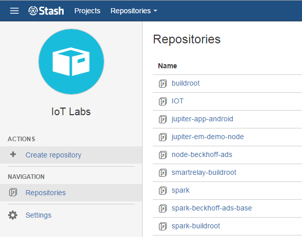
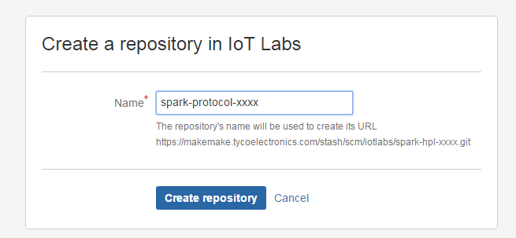
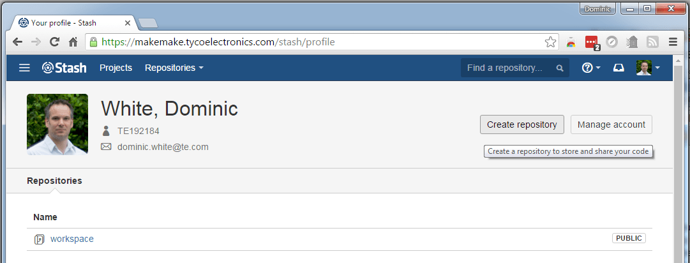
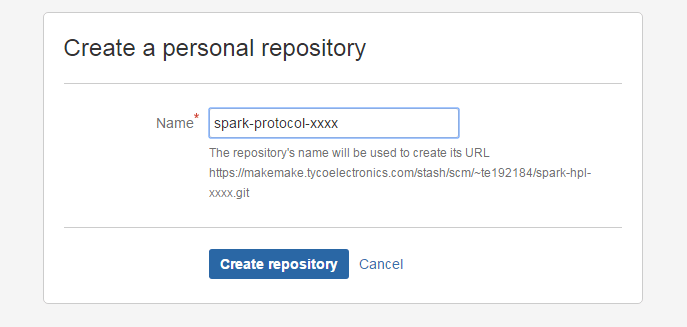
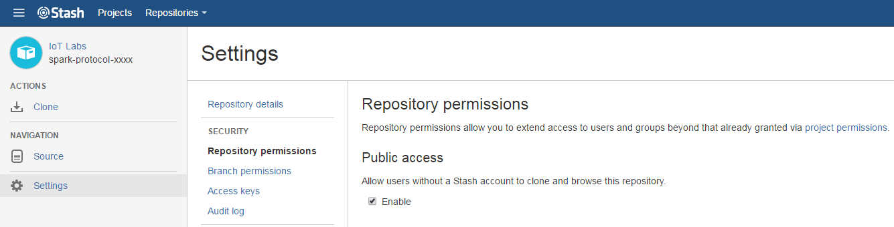
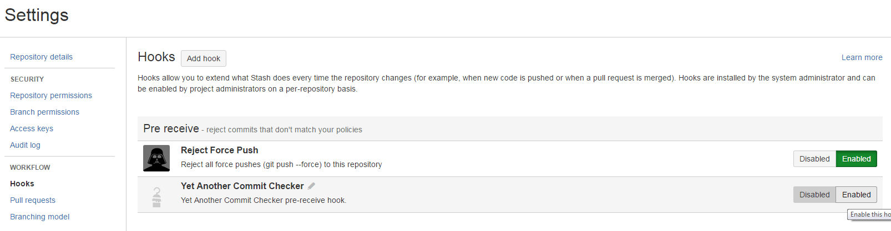
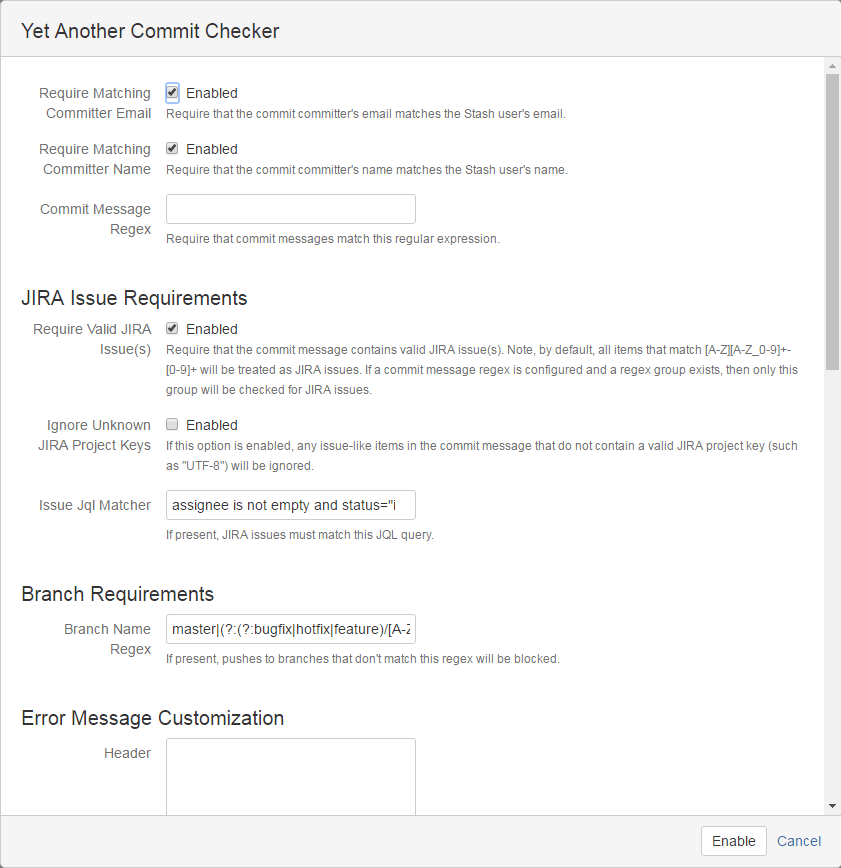
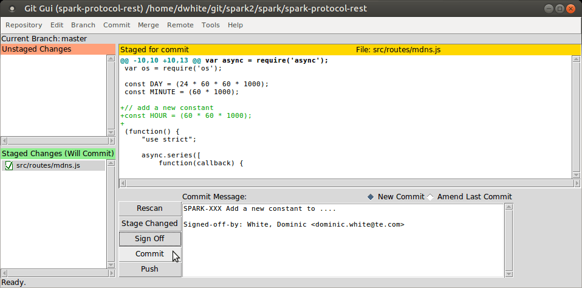

# Adding A Protocol Layer
<!-- The table of contents is auto generated, do not edit the following section by hand -->

<!-- toc -->

- [Prerequisite Skills](#prerequisite-skills)
- [Integration of non Javascript code into the Protocol.](#integration-of-non-javascript-code-into-the-protocol)
- [Currently Supported Protocols](#currently-supported-protocols)
- [Create a new Git Repository for the new Protocol](#create-a-new-git-repository-for-the-new-protocol)
- [Files Required for the new Protocol Module](#files-required-for-the-new-protocol-module)
- [Initial Repository Commit](#initial-repository-commit)
- [Additional Steps to get a new Protocol Module Integrated into the Spark Framework](#additional-steps-to-get-a-new-protocol-module-integrated-into-the-spark-framework)
- [Testing Spark with the new Protocol](#testing-spark-with-the-new-protocol)
- [Committing Everything Back to Stash](#committing-everything-back-to-stash)

<!-- tocstop -->

The aim of this document is to show how to create a new output Protocol module thus allowing Spark to share data with a greater variety of end services.

This document also shows how to add to and update Spark's git repositories held in the [IoT Labs](https://makemake.tycoelectronics.com/stash/projects/IOTLABS) area of Stash. If you do not have write access to this area it is possible to still commit your new code to your personal area of Stash.

## Prerequisite Skills

This document is aimed at experienced software developers with a good understanding of Linux, Node.js and Javascript. If these skills are not available then it would be advisable to start by following some Javascript and Node.js training. A good place to start is the [NodeSchool](http://nodeschool.io/) website. At a minimum the following classes should be completed:

  * [Basic Javascript](https://www.github.com/sethvincent/javascripting)
  * [Basic Node.js](https://github.com/workshopper/learnyounode)
  * [Node Package Manager](https://github.com/npm/how-to-npm)
  * [ASync](https://github.com/bulkan/async-you)

## Integration of non Javascript code into the Protocol.

This document details how to integrate a new Protocol layer based on an existing Node.js module supporting the underlying protocol. If the protocol is implemented in a different language such as C or C++ then additional development is required which beyond the scope of this document. Packages such as [Node-gyp](https://github.com/nodejs/node-gyp) can be used to enable the integration of C libraries into a Node.js module. There is a training module [here](https://github.com/workshopper/goingnative) which gives some guidance on how the process works. A working example can be found in the [Beckhoff ADS](https://makemake.tycoelectronics.com/stash/projects/IOTLABS/repos/node-beckhoff-ads/browse) implementation of Spark.

## Currently Supported Protocols

Currently Spark supports the following list of Protocols

  * REST as a server (data can be requested/pulled from Spark), but it does not act as a client (does not talk to other REST APIs i.e. for posting out Spark data)
  * OPC-UA as a server
  * Flume HTTP, which is based on a simple REST push that sends machine variable data as and when it is produced.
  * Websockets, where machine variable data is emitted to connected clients as and when it is produced.

## Create a new Git Repository for the new Protocol
The first task is to create a new git repository within the [IoT Labs](https://makemake.tycoelectronics.com/stash/projects/IOTLABS) area of Stash. This needs to observe the following naming convention.
__spark-protocol-xxxx__ where __xxxx__ is the new protocol name e.g. __spark-protocol-opcua__

Create Repository Step 1  |  Create Repository Step 2
------------ | -------------
 | 

If you do not have permission to create a repository within the IoT Labs area of Stash then you can create a new repository in your personal area in [Stash](https://makemake.tycoelectronics.com/stash/profile).

Create Personal Repository Step 1  |  Create Personal Repository Step 2
------------ | -------------
 | 

## Files Required for the new Protocol Module

Create a new directory of the same name in the Spark project directory (if there is currently no Spark repository cloned, then the instructions in the _Getting a Spark Development Environment Setup on a Linux Virtual Machine_ document can be used to create one).

```
$ mkdir ~/git/spark/spark-protocol-xxxx
$ cd ~/git/spark/spark-protocol-xxxx
```

Now in this directory there needs to be the following files.

### 1) .gitignore

A special file that git uses to ignore certain build or temporary files that should not be added to the repository. This can be copied from an existing Protocol.

### 2) package.json

A file describing the module and its dependencies. This can be copied from an existing Protocol, but the Protocol's name will need to be updated accordingly (including the git repository url). It is also important to ensure any dependencies used in the main javascript file are included in this file, and at the intended version.

In this OPC-UA Protocol example the module specifically uses _node-opcua_. The other dependencies, _async_ and _lodash_ are required by all Protocol frameworks.

Note, the names as given from [npmjs](https://www.npmjs.com) are used, as they may differ from their git repository names.

```javascript
{
    "name": "spark-protocol-opcua",
    "fullname": "OPC-UA Server",
    "version": "0.0.1",
    "description": "Spark OPC-UA Server using node-opcua",
    "main": "index.js",
    "repository": {
        "type": "git",
        "url": "https://makemake.tycoelectronics.com/stash/scm/iotlabs/spark-protocol-opcua.git"
    },
    "keywords": [
        "Spark",
        "OPC-UA"
    ],
    "author": {
        "name": "Dominic White",
        "email": "dominic.white@te.com"
    },
    "dependencies": {
        "async": "2.0.0-rc.4",
        "lodash": "4.12.0",
        "node-opcua": "0.0.54"
    },
    "devDependencies": {
        "bunyan": "1.8.1"
    }
}
```

This file can be added to as dependencies are required by the Protocol as it develops.

### 3) config.json

This file details the configuration settings required for the Protocol. This is used to create the Protocol's config database entry and is used by the WebAdmin in how it shows the configuration options for the Protocol.

The configuration settings added are ones that are deemed necessary by the underlying protocol being supported. At the bare minimum there needs to be an _enable_ setting to allow any Protocol interface to be turned on and off.

It is split into the following three sections for _model_, _schema_, and _form_.

The _model_ section is used to define the storage elements for the config items, and allows initial defaults to be written to the database. Below is an example from the Flume Protocol.

```javascript
"model": {
    "enable": true,
    "flumeHostName": "",
    "flumePort": 44444,
    "sendPacketCount": 10,
    "connectedToFlume": false
},
```

The _schema_ section details the name, description, storage type and range of each of the configuration settings. The type can be boolean, integer, or string.

Here is an example of a integer type that is used to set the IP port number that Flume will use. The user input in this case will be bounded by the optional _minimum_ and _maximum_ properties.

```javascript
"flumePort": {
    "title": "Flume port",
    "description": "The Apache Flume server port to connect to.",
    "type": "integer",
    "minimum": 1,
    "maximum": 65535,
    "required": true
},
```

Strings can be bounded by either adding an enumerated list of possibilities for the string. This will cause a drop down list to be used rather than a freeform text box.

```javascript
"baudRate": {
	"title": "Serial Baud Rate",
	"description": "Choose the Baud Rate for the serial device.",
	"type": "string",
	"enum": ["75", "110", "300", "1200", "2400", "4800", "9600", "19200", "38400", "57600", "115200"]
},
```

Or limited by whether they match a specific Regular Expression (REGEX) pattern. In this case the REGEX describes how to allow only valid ip addresses as inputs.

```javascript
"ipAddress": {
	"title": "Flume Agent IP Address",
	"description": "The IP address of the Flume Agent.",
	"type": "string",
	"pattern": "^(?:(?:25[0-5]|2[0-4][0-9]|[01]?[0-9][0-9]?)\\.){3}(?:25[0-5]|2[0-4][0-9]|[01]?[0-9][0-9]?)$",
	"validationMessage": "Must be a valid IPv4 address"
}
```

The schema section also states which of the configuration items are required to be set, as some may be optional.

The _form_ section is used for how it appears on the screen in the WebAdmin i.e. its order. It also allows some logic to hide/show config options based on other config options. For example only show an _ipAddress_ option if configured in _ethernet_ mode, and only show _baudRate_ if configured in _serial_ mode as given in the example below.

```javascript
"form": [
	"enable",
	"requestFrequency",
	"slaveId",
	"highByteFirst",
	"highWordFirst",
	"interface",
	{
		"condition": "model.interface=='serial'",
		"key": "baudRate"
	},
	{
		"condition": "model.interface=='ethernet'",
		"key": "ipAddress",
		"placeholder": "192.168.0.1"
	}
]
```
A version from _spark-protocol-flume-http_ or _spark-protocol-opcua_ can be used and added to as required.

### 4) index.js

This is the main javascript file used to interface between the Spark framework and the protocol API being wrapped by this Protocol module.

#### Base Framework
Each Protocol module conforms to a simple framework with _start_ and _stop_ functions, and a listener for monitoring of any configuration changes specific to that Protocol. The following code can be used as a starting point. The code makes calls out to helper _open_ and _close_ functions which will be detailed later.

```javascript
// mandatory 'requires' to conform to the Spark Protocol framework
var path = require('path');
var EventEmitter = require("events").EventEmitter;
var config = require(path.join(__dirname, 'config.json'));
var pkg = require(path.join(__dirname, 'package.json'));
var async = require('async');
var _ = require('lodash');

// additional 'requires' for the underlying protocol used, and any helper modules
var newProtocolModule = require('someonesProtocolModule');


var info = {
    name: pkg.name,
    fullname: pkg.fullname,
    version: pkg.version,
    description: pkg.description
};
config.info = info;

// create the module, naming based off the underlying protocol being wrapped (inheriting from EventEmitter)
var sparkProtocolXXX = new EventEmitter();
var log;
var db;
var conf;
var messageArray = [];
var pendingMessages = 0;
var protocol;

// start function (note module name must match)
sparkProtocolXXX.start = function(modules, done) {

    log = modules['spark-logging'].exports.getLogger(pkg.name);
    db = modules['spark-db'].exports;
    conf = modules['spark-config'].exports;

    // do the following steps one after another using async
    async.series([
        function(cb) {
            //listen for changes to the config (but only add the listener once)
            if (conf.listeners('set').indexOf(onSetListener) === -1) {
                log.debug('config.settings.model.enable', config.settings.model.enable);
                // call onSetListener function when any change occurs
                conf.on('set', onSetListener);
            }

            //check the config to see if we are disabled
            conf.get('protocols:' + pkg.name + ':settings:model', function(err, model) {
                // if no result, use our local config settings
                if (model)
                    config.settings.model = model;
                cb(null);
            });
        },
        function(cb) {
            // update config based on local config settings
            conf.set('protocols:' + pkg.name, config, cb);
        }
    ],
    function(err, result) {
        // once all async task are completed, check for error
        if (err) {
            return done(err);
        }

        // check enable state before continuing
        if (!config.settings.model.enable) {
            log.info('Disabled');
            // return early but with no error
            return done(null, config.info);
        }

        // call our 'open' helper function to open/start our protocols interface
        open(function(err){
            if(err) {
                return done(err);
            }

            log.info("Started", pkg.name);
            // call the 'done' callback to say we are finished
            return done(null, config.info);
        });
    });
};

// stop function (note module name must match)
sparkProtocolXXX.stop = function(done) {

    // need to cancel the config change listener
    conf.removeListener('set', onSetListener);

    // call our 'close' helper function to close/stop our protocols interface
    close( function(err) {
        if(err) {
            log.error(err);
        }
        client = null;
        log.info("Stopped", pkg.name);
        // call the 'done' callback to say we are finished
        return done(null);
    });
};

// other Spark modules that are required by this one (note module name must match)
sparkProtocolXXX.require = function() {
    return ['spark-logging',
        'spark-db',
        'spark-config',
    ];
};


// private methods
// place any additional helper functions here

// listener function used to trigger restart on any config change
function onSetListener(key) {
    // check if key is related to this module's settings
    var re = new RegExp('protocols:' + pkg.name + ':settings:model:*');
    // if so
    if (re.test(key)) {
        // get the updated version of this config
        conf.get('protocols:' + pkg.name + ':settings:model', function(err, model) {

            // test if there have actually been changes
            if (!_.isEqual(model,config.settings.model)) {

                // if, so cache the updated settings
                config.settings.model = model;

                // and request a restart
                sparkFlumeHttp.emit('restartRequest',info.name);
            }
        });
    }
}

// set the export name to match the module name
module.exports = sparkProtocolXXX;
```

Once the framework is in place the _open_ and _close_ functions should be added.

#### Open Function
The _open_ function has the main responsibility of configuring and opening the underlying protocol. It can also be used to initiate a listener task that can be used to trigger whenever any variable of any machine adds new data to the database, as included in the example here.

```javascript
function open(callback) {

    // call any open/start API's for the underlying protocol here
    // passing in any necessary config items
    protocol = newProtocolModule.create();
    protocol.start(config.settings.model.ipAddress);

    // listen for new data being added to the database
    db.on('added', databaseListener);

    // call back to our start function
    // if any underlying protocol's start method is asynchronous place this callback in the return of their callback
    callback(null);
}
```

If the underlying protocol requires any 'one time' knowledge of available machines and their variables, then this function would also be the place to do it. Here is an example where the machine list is retrieved from the config database and looped through.

```javascript
// get a list of machines from the config
conf.get('machines', function(err, machines) {

    // loop through them
    for (var i in machines) {
        var machine = machines[i];

        // check if it's a valid machine (must have a info section)
        if (machine.hasOwnProperty("info")) {

            // also check if it's enabled
            if (machine.settings.model.enable === true) {

                // tell the protocol about this machine
                protocol.addMachine(machine.info.name);

                for (var j in machine.variables) {
                    // and something about each variable this machine contains
                    protocol.addVariableForMachine(machine.info.name, machine.variables[j].name, machine.variables[j].format);
                }
            }
        }
    }
});
```

If the underlying protocol wants to generate events to request data, then this function would also be the place to register for those events

```javascript
// subscribe to on 'request' events
protocol.on('request', function(machineName, variableName, callback) {

	// got a request from the protocol so get the latest value from the database (for the correct machine/variable)
    db.getLatest(machineName, variableName, function(err, result) {

        // parse result as required and write returned data to protocol
        var parsedResult = parseResultHelper(result);
        callback(parsedResult);
    });
});
```

If the underlying protocol provides an API to write to when new data is available, we would use the _databaseListener_ helper function. Here is an example of an implementation of a _databaseListener_ function that was earlier registered by _open_, and is triggered by any update to the database.

```javascript
function databaseListener(key) {

    // data referenced by the following key has changed, get this updated data from the database
    db.get(key, function(err, result) {

        if (!err) {
            // parse new value returned as required and give it to the underlying protocol
            var machineName = parseResultForMachineName(result);
            var variableName = parseResultForVariableName(result);
            var currentValue = parseResultForValue(result);
            protocol.newData(machineName, variableName, currentValue);
        }
    });
}
```

#### Close Function
The _close_ function is responsible for closing / un-initializing the underlying protocol and anything else that needs stopping e.g. if a timer task or listener had been previously setup.

```javascript
function close(callback) {

    // need to cancel the listen event that triggers on database updates
    db.removeListener('added', databaseListener);

	// call any close function necessary from the protocol's API being using and then execute the provided callback.
	// if the close function is asynchronous then pass the callback provided to it
	// e.g.
    protocol.closeFunction(callback);
	// or if synchronous then do this instead
	protocol.closeFunction();
	callback();
}
```

#### OutputFormat Property
Since data from a machine can now be transformed, either through an equation or a mapping, its format (datatype) may change. To cope with this, an optional _variable_ property called _outputFormat_ has been added, which is presumed to be set when necessary. Thus the Protocol module being developed needs to reference the _outputFormat_ version over _format_ when the _outputFormat_ exists.

```javascript
var variablesFormat;
if(variable.hasOwnProperty("outputFormat")) {
    variablesFormat = variable.outputFormat;
} else {
    variablesFormat = variable.format;
}
```

#### Matching DataTypes
Spark has its own internal labels for different datatypes (which each variable stores in its _format_ or _outputFormat_ properties), if the underlying protocol has its own set of datatypes, a simple key/value object can be utilized to convert between them. In this example there is a conversion between _Spark_ datatypes, and ones used by the _node-opcua_ protocol module.

```javascript
// conversion object to generate opcua types from spark types
var sparkToOpcuaTypes = {'float': 'Float',
                         'double': 'Double',
                         'int8': 'SByte',
                         'int16': 'Int16',
                         'int32': 'Int32',
                         'int64': 'Int64',
                         'uint8': 'Byte',
                         'uint16': 'UInt16',
                         'uint32': 'UInt32',
                         'uint64': 'UInt64',
                         'char': 'String',
                         'bool': 'Boolean'};
```

And it can be used like so

```javascript
var opcuaDataType = sparkToOpcuaTypes[variable[i].outputFormat];
```

#### Format of the Data Returned from the Database
The data returned from the database via the _db.get()_ and _db.getLatest()_ functions, are objects that contain all the necessary information to know where the data has come from and when it was stored.

```javascript
{ machine: 'spark-machine-dummy',  variable: 'temperature',  temperature: '30.481902621931024',  _id: '160',  createdAt: '2016-06-17T10:05:01.281Z' }
```

This metadata can be used when updating the underlying protocol as to where the data has come from and when it was written.

#### Converting Data
It is important to note that the database actually stores and therefore returns all data in the _String_ format. Depending on the underlying protocol being supported the values returned to it may need to be converted back to actual numbers. The JSON.parse method can be used to achieve this.

```javascript
// convert from string to the correct value if necessary
if( variableFormat !== 'char') {
    returnValue = JSON.parse(resultAsString);
} else {
    returnValue = resultAsString;
}
```

For a fuller example that also handles arrays returned from the database, see the spark-protocol-opcua's _convertFromStringToOpcuaFormat_ function.

## Initial Repository Commit
Before too much code is written it is a good idea to create an initial commit back to the Stash git repository.

```
$ cd ~/git/spark/spark-protocol-xxxx
$ git init
$ git add --all
$ git commit -m "SPARK-XX Initial Commit"
$ git remote add origin https://TE_NETWORK_ID@makemake.tycoelectronics.com/stash/scm/iotlabs/spark-protocol-xxxx.git
$ git push origin master
```

Where _spark-protocol-xxxx_ is the name of the Protocol, _SPARK-XX_ in the commit message is the Jira reference back to the appropriate Jira task, and _TE_NETWORK_ID_ is the Network ID of the person committing the code e.g _TE192184_. If you are commiting back to your personal Stash area, the url will take the following form

```
https://TE192184@makemake.tycoelectronics.com/stash/scm/~te192184/spark-protocol-xxxx.git
```

Note that as this is not yet linked as a subproject of the main Spark repository (in terms of git), it will not effect any other Spark users. So it is ok that it is still in development and non-functional.

### Updating Repository Settings (IoT Labs Repositories only)
With the initial commit done, now is a good opportunity to modify some of the repository settings in Stash. Navigating to the [IoT Lab's Stash Page](https://makemake.tycoelectronics.com/stash/projects/IOTLABS) in a browser and clicking on _Settings_ then _Repository permissions_ and ticking the _Public access_ checkbox as shown.



This is required for the Jenkins server to check out the whole Spark repository when it does its regular testing.

Next clicking the _Hooks_ option and enabling both _Reject Force Push_ and _Yet Another Commit Checker_ as shown.



Clicking on _Yet Another Commit Checker_ pops up a settings page which should be filled in as shown.



Setting the _Issue Jql Matcher_ line to

```
assignee is not empty and status="in progress" and project=SPARK
```

Setting the _Branch Name Regex_ line to

```
master|(?:(?:bugfix|hotfix|feature)/[A-Z]+-\d+-.+)
```

Then the _Enable_ button should be clicked to activate. The _Yet Another Commit Checker_ rules tightens up how code is checked into the repository. Any updates to this repository must now have a commit message that starts with a valid Jira ID and that Jira task must be in the _In Progress_ state.

## Additional Steps to get a new Protocol Module Integrated into the Spark Framework

To allow the new Protocol to be built and seen as part of Spark (either for a Buildroot image to run on Spark hardware, or for use on a Linux Virtual Machine), it is necessary to modify the base _spark-protocol_ module. All that is required is to add the relative path of the new module to the dependency list in the spark-protocol's package.json file as shown below.

```javascript
"dependencies": {
        "async": "2.0.0-rc.4",
        "lodash": "4.12.0",
        "spark-config": "../spark-config",
        "spark-db": "../spark-db",
        "spark-logging": "../spark-logging",
        "spark-plugin": "../spark-plugin",
        "spark-protocol-flume-http": "../spark-protocol-flume-http",
        "spark-protocol-http": "../spark-protocol-http",
        "spark-protocol-opcua": "../spark-protocol-opcua",
        "spark-protocol-rest": "../spark-protocol-rest",
        "spark-protocol-websockets": "../spark-protocol-websockets",
        "spark-protocol-xxxx": "../spark-protocol-xxxx"
    },
```

## Testing Spark with the new Protocol
Spark should now be ready to be rebuilt using the buildroot build system or built locally on a Virtual Machine.

### Enabling the new Protocol
Once the updated Spark is running, the WebAdmin's 'Protocols' list should now show the new Protocol. This can be clicked on to configure and enable the Protocol.

## Committing Everything Back to Stash

Once the Protocol has been developed and is working as expected, the changes to the _spark-protocol_ repositories and any further changes to the new Protocol should be committed to the Spark repositories.

If the module has been developed in a personal repository, then the following tasks will need to be done by a member of IoT Labs team that has the correct permissions to write to the required repsoitories within the IoT Lab Stash area, so the task should be handed over at this point.

To commit all the modified repositories back, some care is needed to avoid merge issues, as there may have been further commits from other users to the Spark repositories.

First a git pull on the main Spark repository is done. Note that this does not pull in any submodule changes yet, but does show what submodules have been changed.

```
$ cd ~/git/spark
$ git pull
$ git status
```

The output from the _status_ might show something like this.

```
modified:   spark-manual (new commits)
modified:   spark-protocol (new commits, modified content)
modified:   spark-protocol-opcua (new commits)
```

_modified content_ means local changes made that are not in the repository, these are down to the changes made for integrating the new Protocol into Spark.

_new commits_ means that there are changes made by other users to a submodule, which need _pulling_ in to this cloned repository.

If a submodule has both _modified content_ and _new commits_ then merge problems could occur. The easiest way to deal with these is to stash the local changes away, then do the submodule pull, then pop the local changes back. So for each submodule that has this problem the following should be done (the example is given for _spark-protocol_). Note that if there are new untracked files they should be added using the _git add_ command prior to the _git stash_.

```
$ cd spark-protocol
$ git stash
$ git pull
$ git stash pop
$ cd ..
```

Once all these cases are dealt with (or if there were none) it is now safe to do a global submodule pull from the main Spark directory.

```
$ cd ~/git/spark
$ git submodule update --init --recursive
$ git submodule foreach -q 'git checkout $(git config -f $toplevel/.gitmodules submodule.$name.branch || echo master)'
$ git submodule foreach git pull
```

Now all of the locally modified repositories should have their changes committed. In this example it shows the process for the _spark-protocol_ repository.

```
$ cd ~/git/spark/spark-protocol
$ git add --all
$ git commit -m"SPARK-XX Added Protocol-XXXX to Spark"
$ git push
```

Remembering to set the commit message appropriately.

### Link to the Main Spark Repository as a Subproject
It is now time to add the new Protocol repository as a subproject of Spark. This is done by running the following command, setting the correct URL and directory path based on the new Protocol

```
$ cd ~/git/spark
$ git submodule add -b master https://makemake.tycoelectronics.com/stash/scm/iotlabs/spark-protocol-xxxx.git spark-protocol-xxxx
```

Once a module is linked as a submodule of Spark, every commit done to the submodule should be followed by a commit to the main Spark module repository.

```
$ cd ~/git/spark
$ git add --all
$ git commit -m"SPARK-XX Added Protocol-XXXX to Spark"
$ git push
```

A final step is to set the branch of the new submodule

```
$ cd spark-protocol-xxxx
$ git branch --set-upstream-to=origin/master
```

To manage all the git repositories, it may be useful to use _Git Gui_ via the _git gui_ command to open a UI git tool which shows the changes made to the repository and allows adding (staging), committing, pushing etc.


