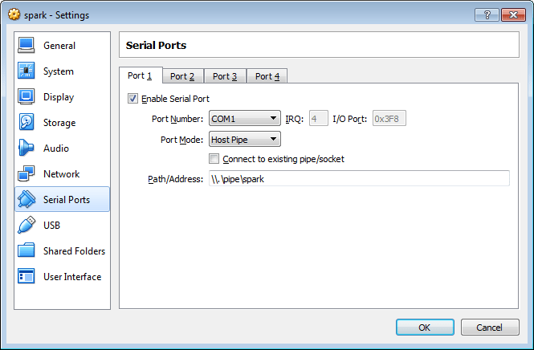
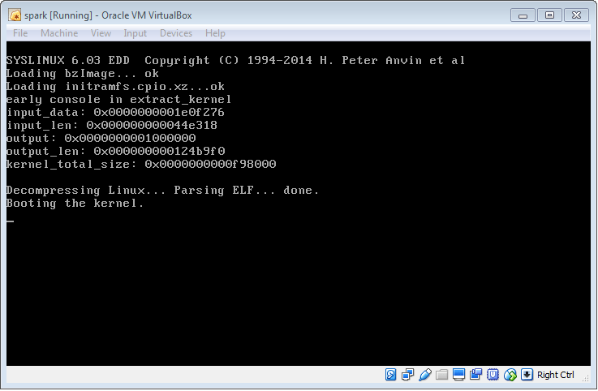

# Development Environment Setup
<!-- The table of contents is auto generated, do not edit the following section by hand -->

<!-- toc -->

- [Introduction](#introduction)
- [Prerequisites](#prerequisites)
- [Downloads](#downloads)
- [Install the Virtual Machine Software](#install-the-virtual-machine-software)
- [Configure the Virtual Machine](#configure-the-virtual-machine)
- [Ubuntu Installation](#ubuntu-installation)
- [Environment Setup](#environment-setup)
- [Adding Spark](#adding-spark)
- [Running Spark inside a Virtual Machine](#running-spark-inside-a-virtual-machine)

<!-- tocstop -->

## Introduction
Starting with a 64 bit Windows 7 laptop, this guide walks you through the process of creating a Spark development (and testing) environment through the use of a Linux Virtual Machine.

## Prerequisites
A Windows 7 PC is required with virtualization enabled in the bios. To check this you will need to reboot your PC and enter the BIOS (use 'Enter' key then 'F1' during startup for a Lenovo W540 or similar laptop). Under the Security/Virtualization section you should see an option to enable/disable Virtualization. Make sure this is set to _enabled_ and then save and exit the BIOS.


## Downloads
The following will need to be downloaded to your Windows PC

A Ubuntu Desktop Linux distribution, preferably 16.04 LTS. You can download via this [link](http://www.ubuntu.com/download/desktop).

VirtualBox virtualization software. The current latest version 5.0.20 is [here](http://download.virtualbox.org/virtualbox/5.0.20/VirtualBox-5.0.20-106931-Win.exe) or go [here](https://www.virtualbox.org/wiki/Downloads) to get the see possibly newer versions.

## Install the Virtual Machine Software

Install VirtualBox using the default installation settings (note that it may restart all networking devices on your host computer during the installation process).

## Configure the Virtual Machine

  * Start the application and click on File/Preferences.
  * Set the location where you would like to install the Linux Virtual Machine (VM) filesystem. It is likely to be around 60GB in size, so if you have a 2nd hard disk installed that has more spare capacity then create a folder in there. e.g. `D:/VirtualBoxVMs`.

Note that on company Lenovo laptops there is generally a hidden second 500GB drive that is not activated. To enable this, type 'Computer Managment' in the Windows search box and click on the found application. Click on the Storage/Disk Management link to see if there is an unallocated disk available. If so you should enable it and set it to be an NTFS drive, then update VirtualBox's preferences to use this drive.


  * Now back in VirtualBox click on the _New_ button.

  

  * This brings up a window to set the VM name, type and version. Fill in with a suitable _Name_ based on your location and the type of VM it will be. Set the _Type_ to Linux and _Version_ to Ubuntu (64 Bit). Note that if you do not see 64 Bit versions of any of the operating systems in this menu it is a sign that the BIOS virtualization settings have not been enabled.

  

  * Click _Next_, and then set the RAM allocated to the VM. For example if you have 32GB of memory perhaps allow the VM 8GB to play with. If you set the memory allocation too low the VM will run more slowly.
  * Click _Next_ and choose to set the filesystem now rather than later, and choose a VDI type filesystem.
  * Set the size to _fixed_ and choose around 60GB in size. If you are using the system drive, first check if that amount of space (and more) is left available, if not reduce the size, but anything less than 60GB will mean that you will be unable to build the full Spark images for the hardware targets. Once chosen, click _Create_ (this may take around 5 to 10 minutes to complete).

  

Further tweaks can now be made via the Settings button.

  * If you have a multi-core machine you can improve the VMs performance using the System/Processor tab and giving the VM more than one core.

  

  * Under the _General/Advanced_ tab you can set a bi-directional clipboard, which is useful for cutting and pasting text between your VM and your host machine.
  * Under the _Display/Screen_ tab you can increase the amount of video memory allocated to perhaps 64MB, but leave the _Enable 3D Acceleration_ checkbox cleared.
  * You can add a folder path back to your windows machine to make copying files between host machine and VM easier by using the _Shared Folders_. In this example a path to the users home directory is created allowing read/write access. The _Auto-mount_ option means that a __/media/sf_te192184__ directory will be created for this particular share.

  

  * Under Storage, click on the circular disk representing an optical drive. Then on the right click on the same circular icon and _Choose Virtual Optical Disk File_ . Browse to your downloaded _ubuntu-16.04-desktop-amd64.iso_ file and click _Open_.

  

  * Click the main _Settings_ _OK_ button to apply all of the above changes.
  * Now start the VM for the first time with the _Start_ button

## Ubuntu Installation
  * Click the _Install Ubuntu_ option from the _try/install_ options page.
  * Check box to install 3rd party software. You can also check the box to download updates if you are not on TE's Network.
  * Choose the Erase disk and install Ubuntu option an click _Continue_.
  * Select the correct timezone and keyboard type from the next two screens.
  * Setup a user name and password and then _Continue_.

  

  * Once installed click the _Restart_ option to restart the virtual machine.

Note when running the VM it will capture your keyboard, so that _Alt-Tab_ will not get you out of the VM, instead it will tab between applications within your VM. To leave the VM you will need to click with your mouse on another host application.

#### Proxy

If you are accessing the Internet via the TE network you will need to use a proxy to get updates and downloads for your Ubuntu VM. Open the _Terminal_ application and use _wget_ to download the TE Proxy script to your home directory and rename it correctly.

```
$ cd ~/
$ wget "https://makemake.tycoelectronics.com/stash/users/te192191/repos/te_proxy/browse/te_proxy?&raw" -O te_proxy
```

Now run it like so.

```
$ source ./te_proxy
```

The first time you run the script you are likely to get errors due to some packages that are not installed yet, but it will enable the proxy settings allowing the Ubuntu package manager to now get updates.

You will need to repeat the above command each time you change networks, restart the VM, or log back in.

#### Updates
Upgrade the VM to the latest version. This may take 10 minutes or so.

```
$ sudo apt-get update
$ sudo apt-get upgrade
```

#### Guest Additions
Installing VirtualBox Guest Additions will allow you to run the VM at full screen, and adds clipboard and shared folder support. Prior to installing you will need to install the following dependencies.

```
$ sudo apt-get install build-essential dkms linux-headers-generic
```

Now select VirtualBox's _Devices_ menu option and choose _Insert Guest Additions CD Image_. If you cannot see this menu try using the _Right Ctrl-A_ key sequence.


Follow the prompts to install, then shutdown and reboot the VM for the changes to take effect. Now when you maximize the VM window it will go full screen and scale the desktop accordingly.

On some occasions the installation can fail and the _cut & paste_ feature may not work. These features rely on kernel modules being built and added correctly, so check if the kernel modules are there with

```
$ lsmod | grep vbox
```

You should see ones from _vboxsf_, _vboxdrv_ and _vboxguest_. If this is not the case try re-installing the Guest Additions and rebooting again.

#### Shared Folder
To get the shared folder up and working properly you will need to add yourself to the _vboxsf_ group. Run the following command but replace the _YOUR_USER_NAME_ with your username.

```
$ sudo adduser YOUR_USER_NAME vboxsf
```

You will then need to log out and back in again for the changes to take effect. The path to the folder you created will be in _/media/sf_YOUR_SHARED_FOLDER_NAME/_

## Environment Setup

#### Git
Now install Git

```
$ sudo apt-get install git git-gui
```

And set your Git username and email address, for example

```
$ git config --global user.name "White, Dominic"
$ git config --global user.email "dominic.white@te.com"
```

Set the defaults for Git push to simple, and increase the http post buffer to allow large data transfers.

```
$ git config --global push.default simple
$ git config --global http.postBuffer 524288000
```

For a more detailed Git setup, see this Confluence article
https://makemake.tycoelectronics.com/confluence/display/MKMK/Install+and+setup+git

#### Development packages
You will need to add some extra development packages to be able to build Spark images. Install the following.

```
$ sudo apt-get install libncurses5-dev gcc-multilib ntp libavahi-compat-libdnssd-dev libusb-dev libudev-dev libexpat1-dev libelf-dev
```

#### Node.js and NVM
Node.js is the javascript runtime that is used by Spark. It is useful to be able to switch versions of Node.js easily, this is where Node Version Manager (NVM) comes in.

To install a recent version of NVM run the following command

```
$ wget -qO- https://raw.githubusercontent.com/creationix/nvm/v0.31.1/install.sh | bash
```

Or go to [here](https://github.com/creationix/nvm) to find the latest version.

You will need to now close and re-open your terminal to start using nvm.

Install a version of Node.js using nvm (6.1.0 is the current preferred version).  This may need to be run while disconnected from the TE vpn and proxy.

```
$ nvm install 6.1.0
```

Set the version to use _for this terminal session only._

```
$ nvm use 6.1.0
```

Set a default version _for any new terminal until the default is changed_.

```
$ nvm alias default 6.1.0
```

#### Atom Editor
A good text editor that works well with javascript is [Atom](https://atom.io). You can install this via Ubuntu's _apt-get_ method if you add an extra repository.

```
$ sudo add-apt-repository ppa:webupd8team/atom
$ sudo apt-get update
$ sudo apt-get install atom
```

Note: The following apm commands are deprecated as atom has been sunsetted and apm no longer works.
Atom has a lot of add-on packages available. A couple of useful ones are _jshint_, which will highlight javascript errors in the editor, and _atom-beautify_ which will allow you to quickly format your code neatly. If you are running inside TE's network it is difficult to add or update these packages within Atom, but you can use the command line Atom Package Manager (APM) to install them if you have previously run the te_proxy script mentioned earlier in this document.

```
$ apm install jshint
$ apm install atom-beautify
```

## Adding Spark

#### Spark Source Code
Clone the Spark git repository and sub repositories using the following commands.

```
$ mkdir ~/git
$ cd ~/git
$ git clone --recursive https://makemake.tycoelectronics.com/stash/scm/iotlabs/spark.git
$ cd spark
$ git submodule update --init --recursive
$ git submodule foreach -q 'git checkout $(git config -f $toplevel/.gitmodules submodule.$name.branch || echo master)'
$ git submodule foreach git pull
```

#### Updating Spark
When you need to update your Spark source repositories to bring in other peoples' changes, run the following commands from the base Spark directory.

```
$ cd ~/git/spark
$ git pull
$ git submodule update --init --recursive
$ git submodule foreach -q 'git checkout $(git config -f $toplevel/.gitmodules submodule.$name.branch || echo master)'
$ git submodule foreach git pull
```

Further information on this and how to check-in changes is detailed in the README.md of the main Spark repository.

#### Building a Spark Image
If you want to create a full Spark image to run on either _rpi3_ or _x86_64_ based hardware, you will need to run Buildroot from the spark-os directory, setting _TARGET_ to either _rpi3_ or _x86_64_ or leave _TARGET_ blank to build for all targets.

```
$ cd ~/git/spark/spark-os
$ make TARGET
```

Note, this will take several hours on the first attempt as there are a lot of toolchain components to build. The final images appear in the _rel_ directory of _spark-os_.

One of the longer stages of the Buildroot build processes is to download all the extra source code required from external repositories. To speed up re-builds (if a full clean is done) it is useful to move this download directory to a separate location outside of spark-os and link to it. For example:

```
$ cd ~/git/spark/
$ mv spark-os/dl/ ~/git/builroot-dl
```

It is then just a case of setting an environment variable that Buildroot will pick up on to locate the download directory. If this is added to the .bashrc file it will always be set for any new terminal that is opened. So after doing the following command close and re-open the terminal.

```
$ echo 'export BR2_DL_DIR="$HOME/git/buildroot_dl"' >> ~/.bashrc
```

#### Re-building Spark
Spark is split into three main processes, _spark-hardware_, _spark-protocol_ and _spark-webadmin_. If you make any changes to the code and would like them to be reflected when re-building then you will need to delete certain Buildroot(spark-os) directories depending on which process the changes affect. For changes that affect _spark-hardware_ e.g. a change to a HPL or a machine then to rebuild with these changes do the following, where _TARGET_ is either _rpi3_ or _x86_64_.

```
$ cd ~/git/spark/spark-os
$ rm -rf output/spark_TARGET/build/spark-hardware-local
$ make TARGET
```

If the change affects _spark-protocol_ e.g. a change to OPC-UA, then delete spark-protocol-local instead. If the change affects a module used in multiple processes e.g. _spark-db_ then you should delete all three _spark-xxx-local_ directories.

```
$ cd ~/git/spark/spark-os
$ rm -rf output/spark_TARGET/build/spark-*
$ make TARGET
```

#### Running Spark in the VM
If you want to run 'Spark' processes on the virtual machine itself rather than on Spark hardware platforms, this is possible too, and can speed up development and test phases.

First you need to install a few global Node.js modules using the Node Package Manager (NPM).

```
$ npm install -g grunt-cli bunyan bower jshint
```

Then add in the Redis database used by Spark to store its configuration and variable data.

```
$ sudo apt-get install redis-server
```

Now run the _setup_ script from the base Spark directory, this will do all the required _npm installs_ for each of the three Spark processes.

```
$ cd ~/git/spark/
$ ./setup
```

Now open up a couple of extra terminal windows so there will be one for each Spark process (using _File->Open Tab_ repeatedly to get all the extra windows in a tabbed format). In the first one start the _spark-hardware_ process.

```
$ cd ~/git/spark/spark-hardware
$ NODE_ENV=production MACHINES_SYSTEM_DIR=../spark-machines MACHINES_USER_DIR=./user node --max_old_space_size=80 src/app.js
```

In the second one start the _spark-protocol_ process.

```
$ cd ~/git/spark/spark-protocol
$ NODE_ENV=production node --max_old_space_size=100 src/app.js
```

In the third one start the _spark-webadmin_ process.

```
$ cd ~/git/spark/spark-webadmin
$ NODE_ENV=production grunt dev
```

You will notice certain environment variables being passed in here. The _NODE_ENV=production_ is to stop the highest _debug_ logging from coming out on the terminal, but you still see _error_ and _info_ logging. If you wish to see all logging you can remove setting this environment variable as the default state is to run in debug mode.

The _--max_old_space_size_ is to restrict the memory given to the process, these are left set so it more accurately reflects how Spark is run on actual hardware.

Using _grunt_ to start the WebAdmin has the effect of starting up the Firefox and loading the WebAdmin interface page.

#### Example 1: Running the Dummy Machine

Now that all the processes are up and running and the WebAdmin interface is being displayed in Firefox, it is a simple matter of enabling the _Dummy Machine_ to test everything is working. Click on the _Dummy Machine_ from the _Machines_ menu on the left side of the interface, and enable it as shown in the image.


Now the Dummy Machine is running, and it should be generating data. To prove this we can plot the variables of the Dummy Machine as they arrive, by using a chart within the WebAdmin.

To add a chart, first enable the edit mode (in the top right there is a pen and pad icon). Choose the __+__ symbol to add a new widget and choose a _Chart_ type widget. Drag the widget using its arrows icon to a location on the right of the screen to make it bigger, then click on its config wheel icon. Set the _Machine_ to _Dummy Machine_ and highlight all the variables to plot and click _Apply_.

Add Chart Widget  |  Configure Chart Widget
------------ | -------------
 | 

The plot should now start getting values for each variable chosen, after a period of time it should look like the image shown below.


To save the WebAdmin windows in this setup, click the down arrow (save changes icon) in the top right, otherwise a page refresh will cause the last saved layout to be loaded, removing the chart widget.

#### Example 2: Running a Simulated Machine

In this next example an external process will be generating the data for the Spark machine. We can use a machine simulator within the Spark source to simulate a physical machine sending data to Spark. In this example we will be using a machine acting as a TCP client that Spark will connect to as a TCP server using a machine that utilizes the _spark-hpl-net_ module.

Click on the _PPT_Datalogic_ machine from the _Machines_ menu on the left side of the interface, and enable it. Note by default it is set to be a server on port 10000. Click on the edit mode button as per Example 1 to allow changes in layout again.

Now click on the chart's config button to modify the chart to get data from the _PPT Datalogic_ machine instead of the _Dummy Machine_. Choose the _Clip 1 Dimension_ and _Clip 2 Dimension_ variables and click _Apply_. The chart will clear as there is no data currently being generated for this machine.

To generate the data we will run a simulator. Open up another terminal tab and change to the _spark-hpl-net/test_ directory and run a TCP Client program that will attempt to connect to our client and send it data applicable to the _PPT_Datalogic_ machine.

```
$ cd ~/git/spark/spark-hpl-net/test
$ node ./testPublishClient.js 127.0.0.1 10000 ../../spark-machines/net/test/ppt-datalogic-publish-data.json 2
```

Now go back to the WebAdmin and you should start seeing data arriving in the chart for the two variables enabled.


A Ctrl-C in the terminal will stop the client from sending data, or the machine can be disabled in the WebAdmin, which will cause the client to disconnect and exit.

#### Accessing Data Externally

To make use of the IP based network outside of local loopback, the type of Network Adaptor given to the VM will need to be changed from _NAT_ to _Bridged_. This will then give an externally accessible IP address to the VM.

To make this change you will need to shutdown the VM and change the VirtualBox settings for this VM. Under Settings->Network set the _Attached to_ option to _Bridged Adaptor_.

Restart the VM and re-run the te_proxy script (if within the TE network), if you then restart all three Spark processes, you will now also be able to connect an external OPC-UA client (like Ignition) to the Spark OPC-UA server running on the VM.

#### Accessing Hardware from the Virtual Machine

If you need to get access to USB devices plugged into the Windows host then you can pass them through using the Devices->USB menu.


For example you may need to access a _USB to Serial_ device plugged into the Windows machine. Use the above method to pass it through and after a short delay if every
thing went ok you should see a tick next to the USB device that has been passed through.


Now for _USB to Serial_ devices, on the command line you should be able to browse the following

```
$ ls -la /dev/ttyUSB0
crw-rw---- 1 root dialout 188, 0 Jun  1 12:40 /dev/ttyUSB0
```

This also tells us the device is in the 'dialout' group, so for us to access this device without root permissions (we don't want to run any of the Node.js processes as root), we need to add ourselves to this dialout group too.

```
$ sudo adduser YOUR_USER_NAME dialout
```

This change will only take effect once the user has been logged out and back in again. Once this is done it will be possible to access _USB to Serial_ devices without root privileges.

Note that there is a degree of unreliablity when running USB to Serial devices within the VM using the Node.js serial drivers that Spark makes use of. Sometimes the serial module within the _spark-hardware_ process will lock up and you will have to Ctrl-C the _spark-hardware_ process and restart it.

#### Editing Code and Re-Running

The main purpose of actually running Spark on a VM as opposed to on the physical Spark hardware is whilst developing a module. You may for example be developing a new HPL for the _spark-hardware_ process (see the _How to integrate a new Hardware Protocol Layer (HPL) into Spark_ document for details on this).

If you have done an _npm install_ in the _spark-hardware_ directory, you will need to do this again each time you make a change to your new code. This is because the code is copied into the _node_modules_ directory of _spark hardware_ when the _npm install_ is done, and it does not know that the code has changed in your separate directory.

An alternative is to remove the directory from _node_modules_ and do an _npm link_ command for your new module.

```
$ cd ~/git/spark/spark-hardware
$ rm -rf node_modules/spark-hpl_MY_NEW_MODULE
$ npm link ../spark-hpl_MY_NEW_MODULE
```

With this method there is an actual link to the code that is being changed, so changes made are reflected when the _spark-hardware_ process is restarted. You can double check which of the Spark modules are linked in this way to _spark-hardware_ by doing an _ls -la_ in its _node_modules_ directory.

```
$ cd ~/git/spark/spark-hardware
$ ls -la node_modules/ | grep spark
drwxrwxr-x   3 dwhite dwhite  4096 Jun 10 11:56 spark-config
drwxrwxr-x   3 dwhite dwhite  4096 Jun 10 11:56 spark-db
drwxrwxr-x   5 dwhite dwhite  4096 Jun 10 11:57 spark-hardware-detect
drwxrwxr-x   2 dwhite dwhite  4096 Jun 10 11:56 spark-hpl-beckhoff-ads
drwxrwxr-x   2 dwhite dwhite  4096 Jun 10 11:56 spark-hpl-dummy
drwxrwxr-x   2 dwhite dwhite  4096 Jun 10 11:56 spark-hpl-modbus
lrwxrwxrwx   1 dwhite dwhite    69 Jun 13 10:45 spark-hpl-net -> /home/dwhite/.nvm/versions/node/v6.1.0/lib/node_modules/spark-hpl-net
drwxrwxr-x   3 dwhite dwhite  4096 Jun 10 11:56 spark-hpl-serial
drwxrwxr-x   3 dwhite dwhite  4096 Jun 10 11:56 spark-logging
drwxrwxr-x   3 dwhite dwhite  4096 Jun 10 11:56 spark-machine-environmental-sensors
drwxrwxr-x   4 dwhite dwhite  4096 Jun 10 11:57 spark-machine-hpl
drwxrwxr-x   7 dwhite dwhite  4096 Jun 10 11:57 spark-machines
drwxrwxr-x   3 dwhite dwhite  4096 Jun 10 11:57 spark-plugin
drwxrwxr-x   2 dwhite dwhite  4096 Jun 10 11:56 spark-sensor-ms5637
```

Here we see that the _spark-hpl-net_ module is linked.

Note this is also possible when developing a new protocol for _spark-protocol_. In this case you would do the following

```
$ cd ~/git/spark/spark-protocol
$ rm -rf node_modules/spark-protocol_MY_NEW_PROTOCOL_MODULE
$ npm link ../spark-protocol_MY_NEW_PROTOCOL_MODULE
```

Note, be careful when removing this link. If you leave a trailing _/_ on the end then it will try and delete the linked directory, which could result in your possibly modified (or new) code being deleted.

```
rm node_modules/spark-protocol_MY_NEW_PROTOCOL_MODULE
```

#### Updating Node.js Version

If you require to change the version of Node.js you are using, to upgrade (or downgrade) using NVM, then it is required that you effectively clean out the build directories of all the sub modules. This can be achieved by running the _cleanup_ script from the base Spark directory. If you have added any files that have not been added in git yet, you should _git add_ them first or they will be removed by this script.

```
$  ./cleanup
```

Note that _cleanup_ will also effectively clean the spark-os Buildroot repository too, so it may be a good idea to keep two Spark repositories on the go, one for running on the VM and one for building code for the target hardware. If that seems like too much work, you can avoid the clean of spark-os by moving the _output_ directory of spark-os temporarily before the _cleanup_ and then moving it back e.g.

```
$ cd ~/git/spark
$ mv ./spark-os/output ../
$ ./cleanup
$ mv ../output spark-os/
```
You will also need to do this for the _dl_ directory if you did not change to using a global download directory as mention in the _Building a Spark Image_ section.

If you do change the Node.js version you will also need to re-install any global modules that you require, e.g. grunt-cli and bunyan. So simply repeat the installation steps for them mentioned in the _Running Spark in the VM_ section.

#### Flushing the Database
The Redis database, used to store the configuration data for Spark (when running on the VM) is persistent. During the development of Spark the organization and contents of this database may change from time to time, so it is useful to be able to flush the contents of this database. This will remove any historical data that is held within it. To do this you need to run the command line program redis-cli.

```
$ redis-cli
127.0.0.1:6379> FLUSHALL
127.0.0.1:6379> exit
```

## Running Spark inside a Virtual Machine
It is also possible to run the x86-64 release of Spark inside VirtualBox.  This can be useful for testing and development since it does not require and additional hardware.  To add a Spark Virtual Machine follow these steps:

* In VirtualBox click on the _New_ button.


* Create a new Virtual Machine for your Spark.  Set Type to _Linux_ and Version to _Other Linux (64-bit)_


* Allocate at least 1G or RAM to the Spark Virtual Machine


* Do not create a disk and accept the warning.  Click the Create button to create the Spark Virtual Machine


* Open a command terminal in the Linux Virtual Machine.  Create a VDI hard disk image that VirtualBox can understand as follows:

```
$ sudo apt-get install qemu-utils
$ cd ~/git/spark/spark-os/output/spark_x86_64/images/
$ qemu-img convert -f raw -O vdi spark_x86_64_4.0.0_sdcard.img spark.vdi
```

* Copy the `spark.vdi` we just created back to the Host running VirtualBox.  For example:

```
$ cp spark.vdi /media/sf_te192184/Desktop/spark.vdi
```

* Back on the Windows 7 Host copy `spark.vdi` from the Desktop to the VirtualBox folder for the Spark Virtual Machine we created.  The will be in `D:/VirtualBoxVMs/spark`
* Open up the settings form the Spark Virtual Machine in VirtualBox.  Go to the System settings and remove the floppy drive


* then allocated more CPU cores to the Spark Virtual Machine


* Now go to the Storage settings and remove the CD Drive


* Next add a new hard disk.  Click the _Choose existing disk_ button and select the spark.vdi we copied into `D:/VirtualBoxVMs/spark`


* Go to the Audio settings and disable it


* Optionally go to the serial settings and add a serial terminal.  This is useful if you require to see the Linux kernel boot messages.  Set the serial port to `\\.\pipe\spark`.  This can then be opened in putty setting the serial port to `\\.\pipe\spark` once the Spark Virtual Machine has started.



The Spark Virtual Machine is now setup.  Start the Spark Virtual Machine and you will see a window open showing Spark booting.



If you setup a serial port then you can configure putty to connect to in using the serial port `\\.\pipe\spark`


Once booted you will see a normal login prompt


And on the serial terminal in putty too


Spark is not running inside Virtual Box.  To update the firmware simply use the web admin page.  There is no need to repeat these steps again to setup the Spark Virtual Machine.
