# Installation Manual
<!-- The table of contents is auto generated, do not edit the following section by hand -->

<!-- toc -->

- [Supported Hardware](#supported-hardware)
  - [Advantek ARK-1123C](#advantek-ark-1123c)
  - [Raspberry Pi](#raspberry-pi)
  - [Supported Wi-Fi Devices](#supported-wi-fi-devices)
- [Connecting To Spark Using A Serial Terminal](#connecting-to-spark-using-a-serial-terminal)
  - [Serial Terminal Using Windows 7](#serial-terminal-using-windows-7)
  - [Serial Terminal Using Linux](#serial-terminal-using-linux)
  - [Login](#login)
  - [Keyboard Layout](#keyboard-layout)
- [Configuring The Network Interface](#configuring-the-network-interface)
  - [Check The Current Network Settings](#check-the-current-network-settings)
  - [Using Wi-Fi](#using-wi-fi)
  - [Static IP Address](#static-ip-address)
  - [Force a static IP at boot](#force-a-static-ip-at-boot)
- [Tethering](#tethering)
  - [Bluetooth Tethering Using Windows 7](#bluetooth-tethering-using-windows-7)
  - [Bluetooth Tethering Using Windows 10](#bluetooth-tethering-using-windows-10)
  - [Bluetooth Tethering Using Android](#bluetooth-tethering-using-android)
  - [Bluetooth Tethering Using iOS](#bluetooth-tethering-using-ios)
- [Set The Timezone, Date And Time](#set-the-timezone-date-and-time)
  - [Timezone](#timezone)
  - [Date And Time](#date-and-time)
  - [Manually set the NTP server](#manually-set-the-ntp-server)
- [Setting Up Machines](#setting-up-machines)
  - [The Spark Web Admin](#the-spark-web-admin)
  - [Hardware Setup](#hardware-setup)
  - [Configure The Machine](#configure-the-machine)
  - [Display A Chart](#display-a-chart)
  - [Using Spark Protocols](#using-spark-protocols)
- [Firmware](#firmware)
  - [Initial Firmware Setup](#initial-firmware-setup)
  - [Update Using Spark Web Admin](#update-using-spark-web-admin)
  - [Update Micro SD Card or USB Dongle Directly](#update-micro-sd-card-or-usb-dongle-directly)

<!-- tocstop -->

The following manual is intended to be read by anyone setting up a Spark device.  The manual covers details on how to setup the Spark hardware ready for use including connecting Spark to the network.

# Supported Hardware
## Advantek ARK-1123C
The [Advantek ARK-1123C](http://www.advantech.com/products/92d96fda-cdd3-409d-aae5-2e516c0f1b01/ark-1123c/mod_0b91165c-aa8c-485d-8d25-fde6f88f4873/) is an dual core 64-bit Intel Atom based device.  The Advantek ARK-1123C should have the following hardware setup:
1. No hard disk installed. Do not install a hard disk in the Advantek ARK-1123C as Spark is designed to run from an USB dongle.
2. Minimum of 1G installed RAM

The diagrams below shows the connections available on the Advantek ARK-1123C
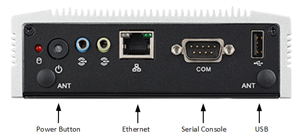
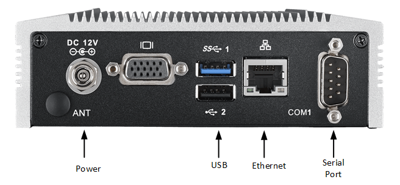

Spark is designed to boot from a USB dongle.  It is recommended to plug the dongle into the Blue USB 3 port.  See the [Firmware](#firmware) section for detail in setting up the USB dongle for the ARK-1123C.

Either Ethernet port can be used for a wired network.  To use Wi-Fi you need to connect a supported USB Wi-Fi dongle to the connector shown in above diagram.  See the section on [Supported Wi-Fi devices](#supported-wi-fi-devices) for details on available USB Wi-Fi dongles.  The Wi-Fi dongle is optional and Spark will operate without it.  The USB Wi-Fi dongle can be plugged into any of the USB ports on the ARK-1123C.  Details on setting networking are below in the section [Configuring The Network Interface](#configuring-the-network-interface).

The serial port can be configured for RS-232, RS-422 or RS-485.  To change the serial port configuration requires booting into the BIOS as follows:
1. Connect a VGA monitor to the ARK-1123C
2. Connect a USB keyboard one of the USB ports
3. Power on the ARK-1123C and in the BIOS screen press the Del key to enter the BIOS
4. Use the keyboard to navigate to the menu `Advanced` -> `SCH3106 Super IO Configuration` -> `Serial Port 1`
5. Under COM1 Mode Choose from `RS-232`, `RS-422` or `RS-485` mode as required
6. Navigate back to the `Save & Exit` menu and choose `Save Changes and Exit`
7. The BIOS will exit and the ARK-1123C will reboot

> _Note:_ Only changing `Serial Port 1` is supported because `Serial Port 2` is used for the serial terminal in spark

## Raspberry Pi
Spark can be run on a [Raspberry Pi 3 Model B+](https://www.raspberrypi.org/products/raspberry-pi-3-model-b-plus) or [Raspberry Pi 4 Model B](https://www.raspberrypi.org/products/raspberry-pi-4-model-b).

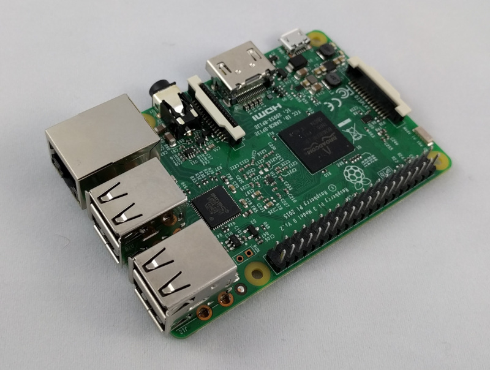

To access the serial console use an FTDI based USB-to-serial cable such as the [TTL-232R-RPI](http://uk.farnell.com/Ttl232RRpi) and connect it as follows:

*USB-to-serial cable* | *RPI2 GPIO Pin*
--------------------- | ---------------
Ground                | 6 (Gnd)
Rx                    | 8 (TxD)
Tx                    | 10 (RxD)

## Supported Wi-Fi Devices
The Spark software stack supports for Realtek based Wi-Fi devices.  The following Realtek based Wi-Fi devices that have been tested and are known to work:

*Description*                                                                                                                                   | *Image*
----------------------------------------------------------------------------------------------------------------------------------------------- | ---------------------------------------------
RealTek RTL8191S Based USB Wi-Fi Dongle. Available from [Amazon](http://www.amazon.co.uk/CSL-Adapter-antenna-Wireless-connection/dp/B015Y26TEO) | 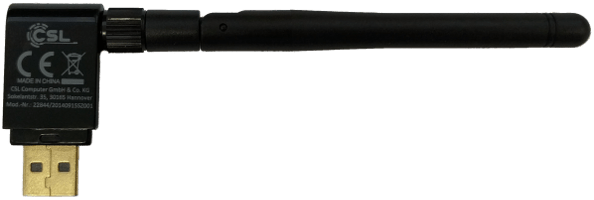
RealTek RTL8192CU Based USB Wi-Fi Dongle. Available from [adafruit](https://www.adafruit.com/product/1030) | 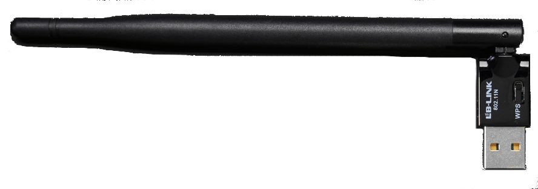

# Connecting To Spark Using A Serial Terminal
This sections describes connecting a serial terminal to Spark using either Windows 7 or Linux.  The port of the Spark you will need to connect to depends on the Spark platform.  Refer to [Supported Hardware](#supported-hardware) for information on how to connect the serial port to Spark.

## Serial Terminal Using Windows 7
To connect to Spark using a Windows 7 machine follow these steps
- Install the latest version of [PuTTY](http://www.chiark.greenend.org.uk/~sgtatham/putty/download.html) to connect to the Spark serial terminal.
- Plug in the Spark serial cable into the Windows 7 machine and wait for Windows to install the drivers.
- Click on `Start` -> `Control Panel` -> `Device Manager` to open up the Device Manager and check the COM port Windows is using.  In this example Windows is using COM10.

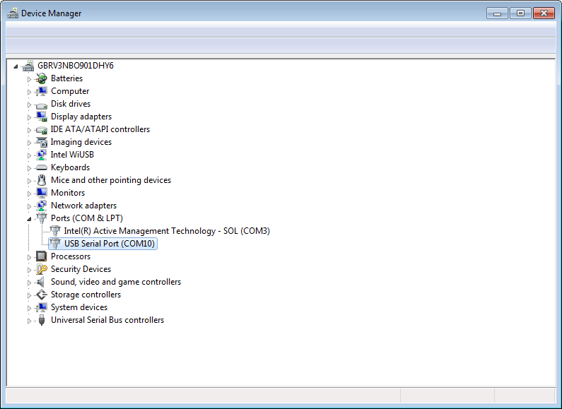
- Click on `Start` -> `All Programs` -> `PuTTY` -> `PuTTY` to open up PuTTY.  Choose a `Connection type` of Serial, set the `Serial Line` to the COM port you found in the Device Manager and the `Speed` to **115200**.

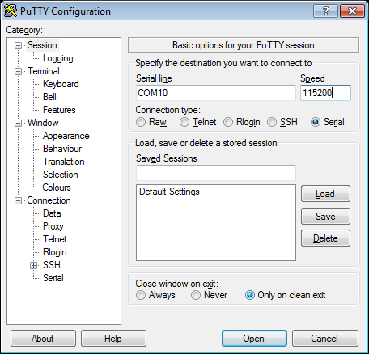
- Click the `Open` button to connect to Spark over the serial interface.

## Serial Terminal Using Linux
To connect to Spark using a Linux machine follow these steps
- Plug the serial port into the Linux machine and open a terminal session.
- In the terminal type `dmesg` to check which device the serial port connected as, you should see some messages similar to this showing the device is ttyUSB0

```
[ 1323.184791] usb 1-2: new full-speed USB device number 3 using ohci-pci
[ 1323.771708] usbcore: registered new interface driver usbserial
[ 1323.771729] usbcore: registered new interface driver usbserial_generic
[ 1323.771747] usbserial: USB Serial support registered for generic
[ 1323.776119] usbcore: registered new interface driver ftdi_sio
[ 1323.776143] usbserial: USB Serial support registered for FTDI USB Serial Device
[ 1323.776177] ftdi_sio 1-2:1.0: FTDI USB Serial Device converter detected
[ 1323.776225] usb 1-2: Detected FT-X
[ 1323.795446] usb 1-2: FTDI USB Serial Device converter now attached to ttyUSB0
```

- Install the `picocom` application.  For [Ubuntu](http://www.ubuntu.com) or [Debian](https://www.debian.org) based distributions type `sudo apt-get install picocom`.  For [Arch Linux](https://www.archlinux.org) type `sudo pacman -S picocom`.
- Once picocom is installed type the following command, replacing the device with the device you found from `dmesg`

```
picocom -b115200 /dev/ttyUSB0
```

- You are now connected to Spark over the serial interface

> **Note:** to exit picocom Type `Ctrl+A` then `Ctrl+Q`.  There is more information on [using picocom here](https://github.com/npat-efault/picocom#using-picocom).

## Login
Once you have connected using the serial port you will be greeted with a Linux command prompt.  If you don't see anything on the terminal then press the `Enter` key.

```
Welcome to Spark
spark-b827eba098ed login:
```

You can login using username `sparkadmin` and password `Pyro!`.  `sparkadmin` is a normal user and hence only has limited permissions.  To run commands with root permissions as the  `sparkadmin` user use the `sudo` command.  The sudo command will ask for the password again.

## Keyboard Layout
The keyboard defaults to a US Qwerty keyboard layout.  Use the `loadkeys` command to change the keyboard layout.  For example to set the keyboard to a UK keyboard you would Type

```
sudo loadkeys uk
```

The available keyboard layouts can be seen under `/usr/share/keymaps`.

> **Note:** This change is not saved between reboots of Spark.

# Configuring The Network Interface
The wired network on Spark is configured by default to auto connect using DHCP.  If this is suitable for your network then there is nothing further to do.  If however you need to use a static IP address or a Wi-Fi network then the following section describes the steps to take.

> **Note:** Changes to the network will be saved between reboots of Spark.

## Check The Current Network Settings
To check the current network Settings connect to Spark over the serial terminal and type the command `ip addr`

```
# ip addr
1: lo: <LOOPBACK,UP,LOWER_UP> mtu 65536 qdisc noqueue
    link/loopback 00:00:00:00:00:00 brd 00:00:00:00:00:00
    inet 127.0.0.1/8 scope host lo
       valid_lft forever preferred_lft forever
2: eth0: <BROADCAST,MULTICAST,UP,LOWER_UP8000> mtu 1500 qdisc fq_codel qlen 1000
    link/ether b8:27:eb:a0:98:ed brd ff:ff:ff:ff:ff:ff
    inet 192.168.1.100/24 brd 192.168.1.255 scope global eth0
       valid_lft forever preferred_lft forever
    inet6 fe80::ba27:ebff:fea0:98ed/64 scope link
       valid_lft forever preferred_lft forever
3: wlan0: <NO-CARRIER,BROADCAST,MULTICAST,UP8000> mtu 1500 qdisc fq_codel qlen 1000
    link/ether 24:05:0f:36:40:27 brd ff:ff:ff:ff:ff:ff
4: sit0@NONE: <NOARP> mtu 1480 qdisc noop
    link/sit 0.0.0.0 brd 0.0.0.0
```

`eth0` is the wired network and `wlan0` is the Wi-Fi network.  Here we can see the wired network is using IP address `192.168.1.100`

## Using Wi-Fi
To connect to a Wi-Fi network use the `connmanctl` command line application to configure the Wi-Fi network.  The steps involved are:
1. Turn Wi-Fi on
2. Disable the offline mode, this will ensure Wi-Fi is started on bootup
3. Scan for your Wi-Fi network
4. Use the `agent on` command to get `connmanctl` to prompt you for the Wi-Fi password
5. Find and connect to your Wi-Fi network

To do this type the following commands into `connmanctl`

```
# connmanctl
connmanctl> enable wifi
Enabled wifi
connmanctl> disable offline
Disabled offline
connmanctl> scan wifi
Scan completed for wifi
connmanctl> agent on
Agent registered
connmanctl> services
    Wired                ethernet_b827eba098ed_cable
    TEnet-Enterprise     wifi_24050f364027_54456e65742d456e7465727072697365_managed_ieee8021x
    TEnet-IoT            wifi_24050f364027_54456e65742d496f54_managed_psk
    TEnet-Mac            wifi_24050f364027_54456e65742d4d6163_managed_ieee8021x
    TEnet-Mobile         wifi_24050f364027_54456e65742d4d6f62696c65_managed_ieee8021x
    TEnet-Voice          wifi_24050f364027_54456e65742d566f696365_managed_psk
    guestnet             wifi_24050f364027_67756573746e6574_managed_none
connmanctl> connect wifi_24050f364027_54456e65742d496f54_managed_psk
Agent RequestInput wifi_24050f364027_54456e65742d496f54_managed_psk
  Passphrase = [ Type=psk, Requirement=mandatory ]
Passphrase? mypassword
Connected wifi_24050f364027_54456e65742d496f54_managed_psk
connmanctl> exit
```

In this example we connect to the TEnet-IoT Wi-Fi network.  `connmanctl` will allow Tab completing to save typing in the full name of commands and wifi networks.  After these steps Spark will be connected to the Wi-Fi network, you can confirm this using the `ip addr` command.

> **Note:** Spark will use a wired network in favor of Wi-Fi.  To use Wi-Fi you must disconnect the wired network cable.  If the wired network cable is disconnected then it will not show up in the list of services.

## Static IP Address
To configure Spark to use a static IP address (on a wired or Wi-Fi network) use the `connmanctl` config command.  In the following example we will set Spark to use the IP address `192.168.1.100`, netmask `255.255.255.0` and default gateway `192.168.1.1`.  The config command takes the name of the service you wish to configure, in this example we'll configure the wired network.

```
# connmanctl
connmanctl> services
    Wired                ethernet_b827eba098ed_cable
    TEnet-Enterprise     wifi_24050f364027_54456e65742d456e7465727072697365_managed_ieee8021x
    TEnet-IoT            wifi_24050f364027_54456e65742d496f54_managed_psk
    TEnet-Mac            wifi_24050f364027_54456e65742d4d6163_managed_ieee8021x
    TEnet-Mobile         wifi_24050f364027_54456e65742d4d6f62696c65_managed_ieee8021x
    TEnet-Voice          wifi_24050f364027_54456e65742d566f696365_managed_psk
    guestnet             wifi_24050f364027_67756573746e6574_managed_none
connmanctl> config ethernet_b827eba098ed_cable --ipv4 manual 192.168.1.100 255.255.255.0 192.168.1.1
connmanctl> services
*AO Wired                ethernet_b827eba098ed_cable
    TEnet-Enterprise     wifi_24050f364027_54456e65742d456e7465727072697365_managed_ieee8021x
    TEnet-IoT            wifi_24050f364027_54456e65742d496f54_managed_psk
    TEnet-Mac            wifi_24050f364027_54456e65742d4d6163_managed_ieee8021x
    TEnet-Mobile         wifi_24050f364027_54456e65742d4d6f62696c65_managed_ieee8021x
    TEnet-Voice          wifi_24050f364027_54456e65742d566f696365_managed_psk
    guestnet             wifi_24050f364027_67756573746e6574_managed_none
connmanctl> exit
```

The `*AO` indicates this is a saved network, it will auto connect and is online. See the [connmand documentation](https://01.org/connman/documentation) for more details on these symbols.  You can also confirm the IP address settings using the `ip addr` command.

```
# ip addr
1: lo: <LOOPBACK,UP,LOWER_UP> mtu 65536 qdisc noqueue
    link/loopback 00:00:00:00:00:00 brd 00:00:00:00:00:00
    inet 127.0.0.1/8 scope host lo
       valid_lft forever preferred_lft forever
2: eth0: <NO-CARRIER,BROADCAST,MULTICAST,UP8000> mtu 1500 qdisc fq_codel qlen 1000
    link/ether b8:27:eb:a0:98:ed brd ff:ff:ff:ff:ff:ff
3: wlan0: <BROADCAST,MULTICAST,UP,LOWER_UP8000> mtu 1500 qdisc fq_codel qlen 1000
    link/ether 24:05:0f:36:40:27 brd ff:ff:ff:ff:ff:ff
    inet 192.168.1.100/24 brd 192.168.1.255 scope global wlan0
       valid_lft forever preferred_lft forever
    inet6 fe80::2605:fff:fe36:4027/64 scope link
       valid_lft forever preferred_lft forever
4: sit0@NONE: <NOARP> mtu 1480 qdisc noop
    link/sit 0.0.0.0 brd 0.0.0.0
```

Spark is now configured to use Wi-Fi with a static IP address.  To reset back to using DHCP use the config command again but this time set it for DHCP.

```
# connmanctl
connmanctl> config ethernet_b827eba098ed_cable --ipv4 dhcp
connmanctl> exit
```

## Force a static IP at boot
It is possible to force a static IP address at boot time on a wired network interface as a way to solve setup or configuration issues.  This can be useful in the following situations:
1. During initial setup if you don't have access to the serial console
2. If the network has been missconfigured and you have lost access to Spark

To set a static IP address follow the procedure described below depending on the Spark device you have.

### Raspberry Pi based devices
1. Plug in the Micro SD Card into either a Linux or Window 7 machine
2. Open the file called `cmdline.txt` in a text editor
3. Add the text `ip=192.168.1.100:::255.255.255.0::eth0`.  This will set the wired ethernet to have the static IP `192.168.1.100` and netmask of `255.255.255.0`.
4. Save an close `cmdline.txt`
5. Safely eject the Micro SD Card and plug it back into Spark
6. Connect a crossover network cable between Spark and your Linux or Window 7 machine
7. Setup the Linux or Window 7 machine to have a static IP of `192.,168.1.101` and netmask of `255.255.255.0`
8. Power on Spark
9. You can now ssh into or access the Spark Web Admin at IP `192.168.1.100`

Once you have setup Spark you must remove the static IP setup from `cmdline.txt` or any changes you make to the wired network will not be used when Spark reboots.  To remove the static IP setting simply login to spark using SSH and edit the file using

```
# sudo nano /boot/cmdline.txt
```

And delete the text you added.

You can find more details on the format of the `ip=` setting at [https://www.kernel.org/doc/Documentation/filesystems/nfs/nfsroot.txt](https://www.kernel.org/doc/Documentation/filesystems/nfs/nfsroot.txt)

> **Note:** All changes to `cmdline.txt` will be lost after performing an upgrade.  Any networks configured using the `nmtui` command line application will persist.

### x86-64 based devices including the Atom
1. Plug in the USB Dongle into either a Linux or Window 7 machine
2. Open the file called `syslinux.cfg` in a text editor
3. Locate the line in the file that reads 'append boot=/dev/sda1 root=/dev/sda1 rootwait console=ttyS0,115200'
4. Append the text `ip=192.168.1.100:::255.255.255.0::enp2s0`.  This will set the wired ethernet to have the static IP `192.168.1.100` and netmask of `255.255.255.0`.
5. Save and close `syslinux.cfg`
6. Safely eject the USB Dongle and plug it back into Spark
7. Connect a crossover network cable between Spark and your Linux or Window 7 machine
8. Setup the Linux or Window 7 machine to have a static IP of `192.,168.1.101` and netmask of `255.255.255.0`
9. Power on Spark
10. You can now ssh into or access the Spark Web Admin at IP `192.168.1.100`

Once you have setup Spark you must remove the static IP setup from `syslinux.cfg` or any changes you make to the wired network will not be used when Spark reboots.  To remove the static IP setting simply login to spark using SSH and edit the file using

```
# sudo nano /boot/syslinux.cfg
```

And delete the text you added.

You can find more details on the format of the `ip=` setting at [https://www.kernel.org/doc/Documentation/filesystems/nfs/nfsroot.txt](https://www.kernel.org/doc/Documentation/filesystems/nfs/nfsroot.txt)

> **Note:** All changes to `syslinux.cfg` will be lost after performing an upgrade.  Any networks configured using the `nmtui` command line application will persist.

# Tethering
Spark can be tethered over USB or Bluetooth.  This can be useful in the following situations:
1. initial setup of Spark.
2. to rescue a Spark that the network configuration has gone wrong.
3. to provide networking to Spark, for example using 3g from a mobile phone.

Spark can be tethered over Bluetooth to many Bluetooth enabled devices such as Windows 7 PCs, Linux PCs, Android and iOS devices.  For Bluetooth tethering to be available Spark must have a Bluetooth adaptor.  Spark will use the Raspberry Pi's built in Bluetooth interface, other platforms will require a USB Bluetooth dongle to be connected.

Spark can also be tethered over USB to an Android device that supports cellular networks such as a phone.

## Bluetooth Tethering Using Windows 7
Setup Bluetooth tethering to Windows 7 devices as follows:
1. Open `Devices and Printers` by clicking the `Start` button and then click `Devices and Printers`.
2. Click `Add a device`.  In the window that opens wait for the list of available Bluetooth devices to appear.  You should see Spark devices appear in the list.  Note, it can take a while for devices to appear
3. Click on the Spark device you wish to connect to then click next.
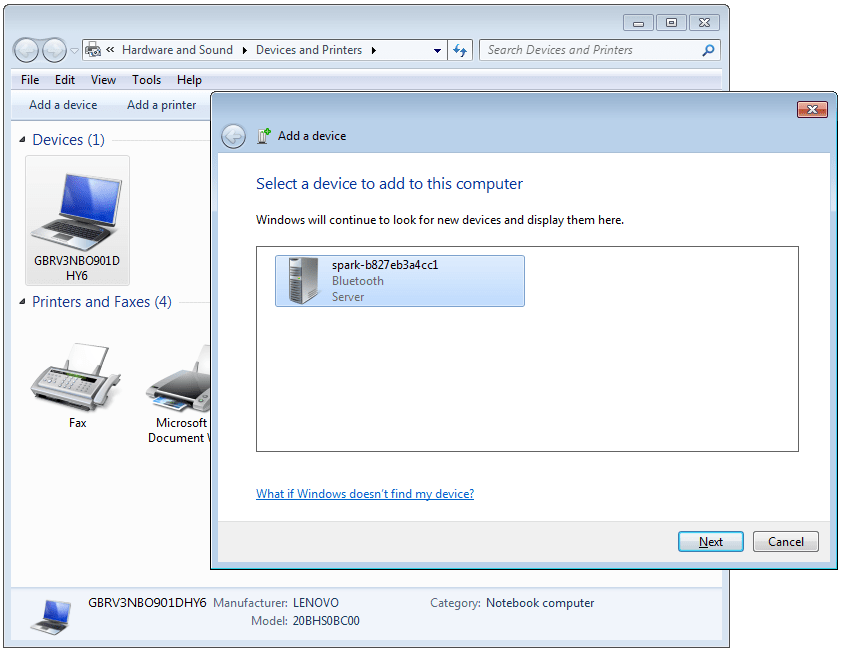
4. Windows 7 will install the necessary drivers and prompt once it has successfully completed adding the Spark device.  Click the `close` button
5. Back in the `Devices and Printers` window you will now see Spark under the list of devices.  To connect to Spark right click on the Spark device and select `Connect Using` -> `Access point`. The Windows 7 PC is now connected to the Spark device.
6. Open up a web browser and go to http://192.168.0.1 to access the Spark Web Admin and configure spark as normal.

## Bluetooth Tethering Using Windows 10
Setup Bluetooth tethering to Windows 10 devices as follows:
1. Open the `Control Panel` under `Windows System` on the `Start` menu.
2. Open `Devices and Printers` by selecting `Hardware and Sound` then `Devices and Printers`
3. Click `Add a device`.  In the window that opens wait for the list of available Bluetooth devices to appear.  You should see Spark devices appear in the list.  Note, it can take a while for devices to appear
4. Click on the Spark device you wish to connect to then click next.
5. Windows 10 will install the necessary drivers and close the `Add a Device` window.
6. Back in the `Devices and Printers` window you will now see Spark under the list of devices.  To connect to Spark right click on the Spark device and select `Connect Using` -> `Access point`. The Windows 10 PC is now connected to the Spark device.
7. Open up a web browser and go to http://192.168.0.1 to access the Spark Web Admin and configure spark as normal.


## Bluetooth Tethering Using Android
Setup Bluetooth tethering to Android devices as follows:
1. Got to `Settings` -> `Bluetooth`.
2. Make sure Bluetooht is enabled.  Note, it make take a while for Spark to appear in the list of availbe Bluetooth device.
3. In the list of available Bluetooth devices select the Spark device you wish to connect to.  Android will pair with the Spark device.
4. Click the Spark device in the list of paired Bluetooth devices and Android will connect to it.
3. Open up a web browser and go to http://192.168.0.1 to access the Spark Web Admin and configure spark as normal.
4. The [ConnectBot](https://play.google.com/store/apps/details?id=org.connectbot) app can be installed so you can login to Spark using SSH from the Android device.
5. To finish click the Spark device in the list of paired Bluetooth devices and Android will ask if you wish to disconnect from it.

## Bluetooth Tethering Using iOS
Setup Bluetooth tethering to iOS devices as follows:
1. Got to `Settings` -> `Bluetooth`.
2. Make sure Bluetooth is enabled.  Note, it make take a while for Spark to appear in the list of availbe Bluetooth device.
3. In the list of available Bluetooth devices select the Spark device you wish to connect to.  iOS will pair with the Spark device.
4. Click the Spark device in the list of paired Bluetooth devices and iOS will connect to it.
5. Open up Safari and go to http://192.168.0.1 to access the Spark Web Admin and configure spark as normal.

# Set The Timezone, Date And Time
If your network uses NTP then Spark will automatically set the date and time, and the timezone will default to UTC.  If you do not have NTP available then it is highly recommended that you correct this.  If this is not possible then you may need to manually set the data and time every time Spark reboots.

> **Note:** The Spark hardware you use may not have a real time clock, so changes to the date and time could be lost between reboots.  Even with a real time clock there will be sufficient drift over time to cause problems, therefore it is highly recommended that NTP is used.

## Timezone
Setting the timezone is optional.  It can be helpful to have the correct timezone to make setting the date and time simpler.  In the following example we set the timezone for London.

```
sudo ln -sf /usr/share/zoneinfo/Europe/London /data/sysroot/etc/localtime
```

In this example we set the timezone for Shanghai.

```
sudo ln -sf /usr/share/zoneinfo/Asia/Shanghai /data/sysroot/etc/localtime
```

The available timezone can be found in the `/usr/share/zoneinfo` directory.

> **Note:** Changes to to timezone will be saved between reboots of Spark.

## Date And Time
If the date and time is not correctly set then Spark will not be able to fully function.  Features such as OPC-UA will not work without the correct date and time.

To manually set the date and time use the `date` command.  The following example sets the date and time to 1st November 2015 at 1pm in your current timezone:

```
sudo date -s "2015.11.01-13:00:00"
```

To check the current date and time simply type the `date` command

```
date
Sun Nov 1 13:00:00 GMT 2015
```

Now the date and time is correct it is recommended to restart some of the Spark internal processes as follows:

```
sudo systemctl restart spark-hardware spark-protocol spark-webadmin
```

## Manually set the NTP server
It is possible to manually set the NTP server using `connmanctl` config command.  This is useful for setups using a static IP address.  The following example sets the NTP server to `192.168.1.1`

```
# connmanctl
connmanctl> services
    Wired                ethernet_b827eba098ed_cable
    TEnet-Enterprise     wifi_24050f364027_54456e65742d456e7465727072697365_managed_ieee8021x
    TEnet-IoT            wifi_24050f364027_54456e65742d496f54_managed_psk
    TEnet-Mac            wifi_24050f364027_54456e65742d4d6163_managed_ieee8021x
    TEnet-Mobile         wifi_24050f364027_54456e65742d4d6f62696c65_managed_ieee8021x
    TEnet-Voice          wifi_24050f364027_54456e65742d566f696365_managed_psk
    guestnet             wifi_24050f364027_67756573746e6574_managed_none
connmanctl> config ethernet_b827eba098ed_cable --timeservers 192.168.1.1
connmanctl> exit
```

The NTP (timeservers) setting can be set for both Wired and Wi-Fi networks.

# Setting Up Machines
The procedure to setup a machine follows these main steps:
1. Connect Spark to the chosen machine
2. Use the Spark Web Admin to configure the machine
3. Configure protocols such as OPC-UA as needed

The following section will show an example of connecting Spark to a Sumitomo Seduz injection molding machine.  The procedure to setup other machines is the same though how spark is connected and available configuration options will differ.

## The Spark Web Admin
First open a web browser on a PC and open a page to the Spark Web Admin.  You can find the IP address of Spark using the `ip addr` command as showing in the [Check The Current Network Settings](#check-the-current-network-settings) section.  In this example the Spark has IP address `192.168.1.100` so we open a page at [http://192.168.1.100](http://192.168.1.100)

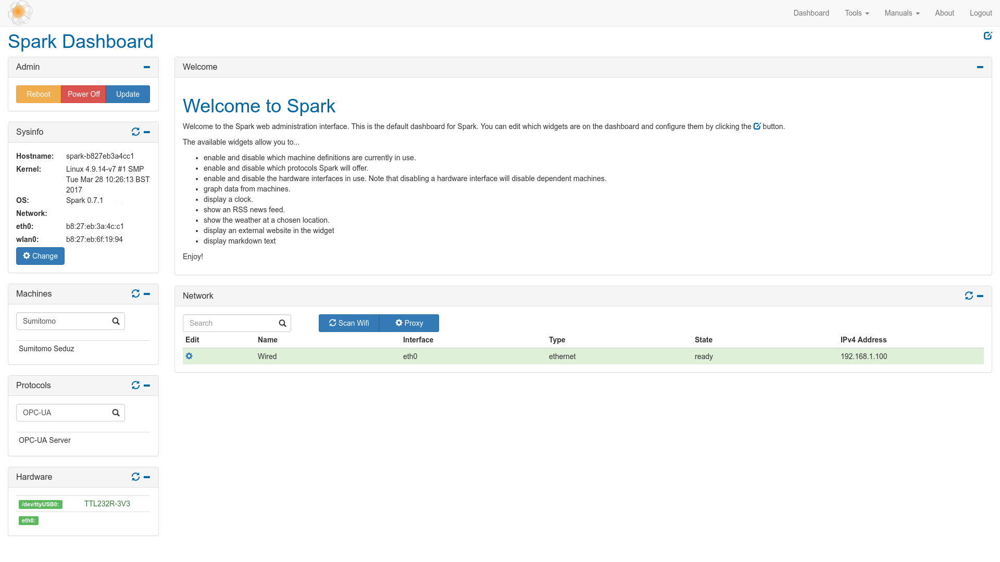

The Spark Web Admin allows configurations of the hardware, machines and protocols used by Spark.

## Hardware Setup
How Spark connects to machines using interfaces such as RS232 or IP networks though it varies from machine to machine.  In this example the Sumitomo Seduz injection molding machine needs an RS232 interface so a USB serial cable would be a suitable choice.

Once the USB serial cable is installed you will see it's details appear in the Spark Web Admin.

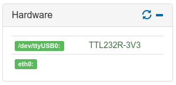

Clicking on USB serial device will bring up a window showing more detailed information.

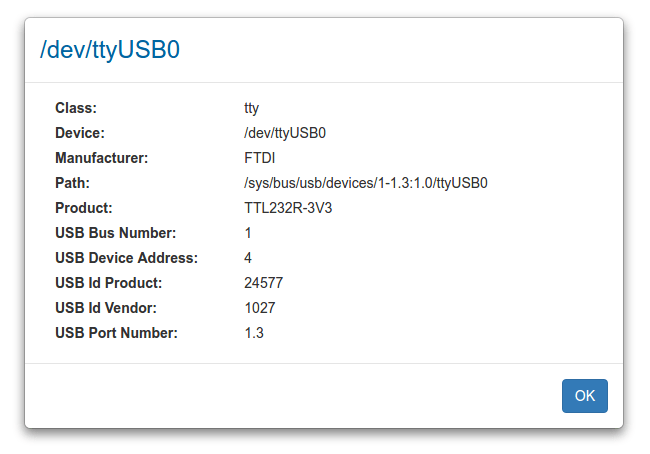

## Configure The Machine
By default all machine definitions are disabled.  To enable the Sumitomo Seduz injection molding machine first type in the search box to find the Sumitomo Seduz machine in the Machines widget then click on `Sumitomo Seduz`.

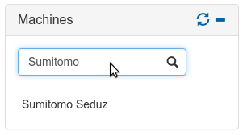

This will open up the configuration window for the Sumitomo Seduz injection molding machine.  We need to choose the correct serial device the Sumitomo Seduz is connected to, in this example we need to choose `/dev/ttyUSB0`

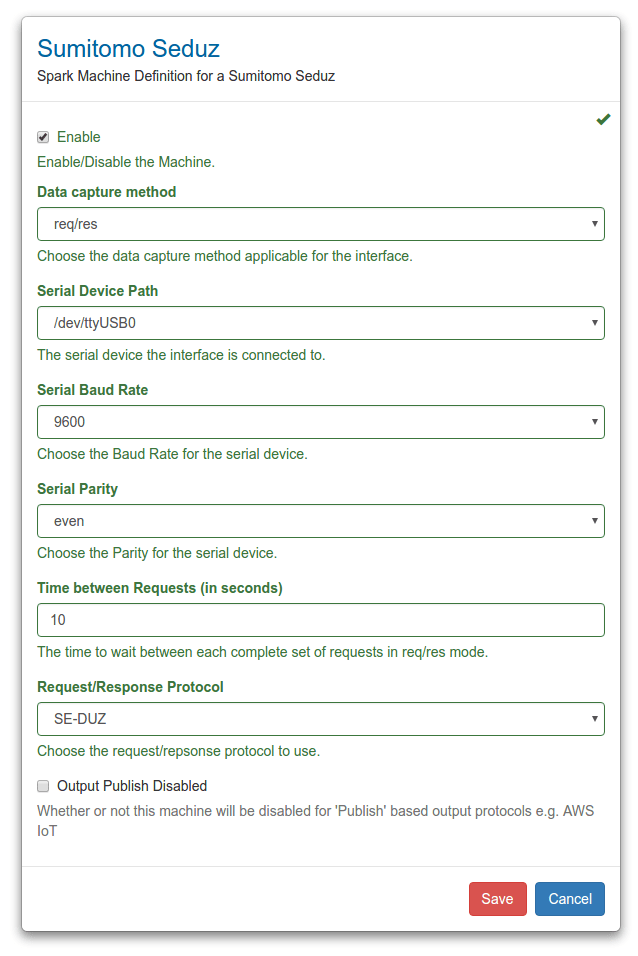

After clicking `Save` Spark will try to connect to the Sumitomo Seduz injection molding machine and gather data from it.  You will now see the Sumitomo Seduz injection molding machine is highlighted <span class="bg-success">green</span> indicating it has been enabled.

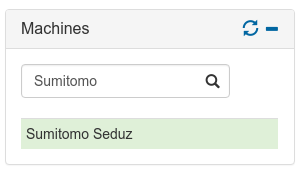

Next we can try to display a chart of this data.

## Display A Chart
The Spark Web Admin has a simple chart widget built in to allow data from machines to be displayed to verify the machine is working.  To add a chart first click the `enable edit mode` icon <span class="te-blue glyphicon glyphicon-edit"></span> then click the `add new widget` icon <span class="te-blue glyphicon glyphicon-plus-sign"></span>. Next choose the `chart` widget from the list of available widgets.

Widgets can be added, deleted and moved in the Spark Web Admin.  Now we have a chart widget click the `change widget location` icon <span class="te-blue glyphicon glyphicon-move"></span> and move it to the right side of the Spark Web Admin to make it easier to view.  The Spark Web Admin should now look similar to the following picture

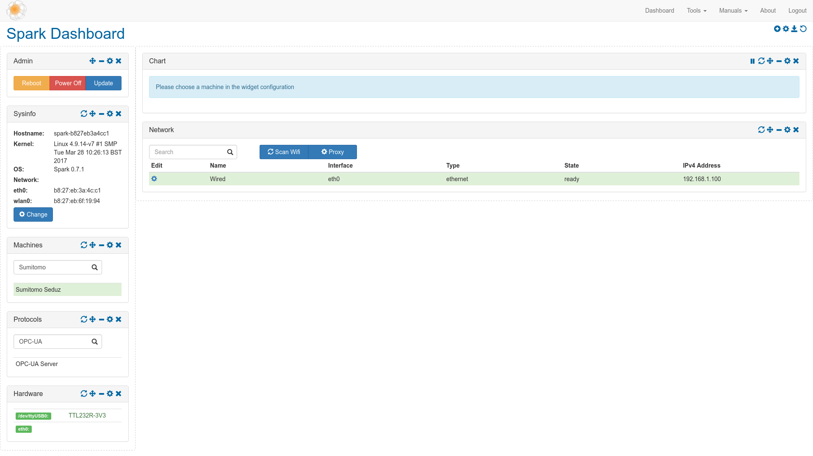

Next click the `edit widget configuration` icon <span class="te-blue glyphicon glyphicon-cog"></span> to edit the chart widget.  This will open the chart configuration window.  Choose the Sumitomo Seduz Injection Molding Machine and select one of it's available variables as show in the picture below

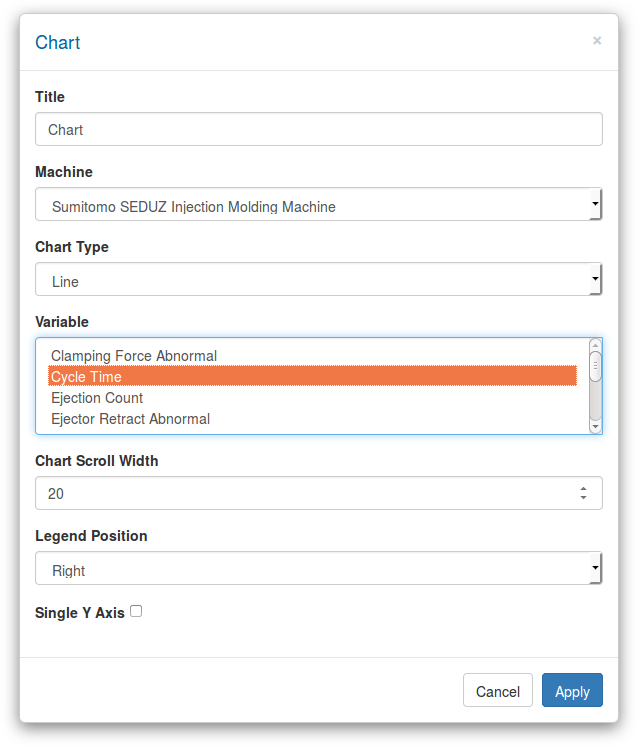

After clicking `save` the window will close and the chart will begin to display data.

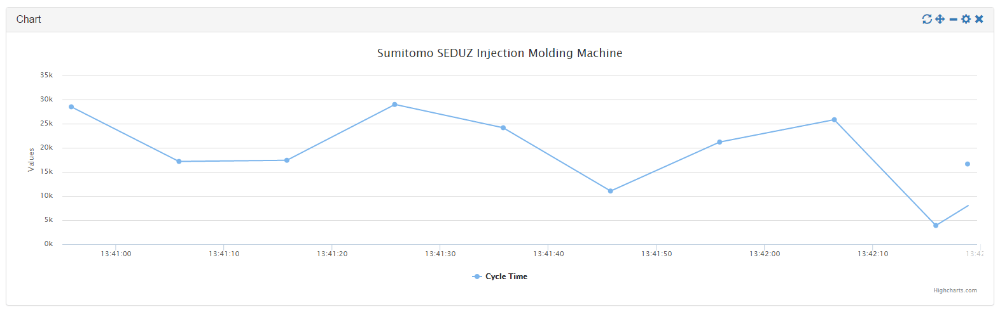

Finally click the `save changes` icon <span class="te-blue glyphicon glyphicon-save"></span> to save the updated dashboard

> **Note:** The dashboard layout and settings are saved between reboots of Spark.

## Using Spark Protocols
By default all the available Spark protocols are enabled though they may need further configuration.  To configure protocols click on a protocol in the Protocols widget to open up it's configuration window. Protocols that are enabled are highlighted in <span class="bg-success">green</span> the same as for enabled machines.

# Firmware
## Initial Firmware Setup
> **Warning:** This following process will erase everything on the Micro SD Card or USB Dongle.

- First download the firmware from the [spark-release](https://te360-my.sharepoint.com/personal/martin_bark_te_com/Documents/spark-release) from the TE OneDrive.  You should see the [spark-release](https://te360-my.sharepoint.com/personal/martin_bark_te_com/Documents/spark-release) folder under your "_Shared with me_" folder in the OneDrive web interface. You can access OneDrive via [https://portal.office.com](https://portal.office.com).
- Unzip the file named `spark_xxx_sdcard.img.zip` where `xxx` will change depending on the Spark platform you are using and version number of the firmware.  Choose the correct file for your Spark Hardware.  Once `spark_xxx_sdcard.img.zip` has been extracted it will produce a file called `spark_xxx_sdcard.img`
- Plug a Micro SD Card or USB Dongle into a PC

### Firmware Setup Using Windows 7
- Install [Win32DiskImager](https://sourceforge.net/projects/win32diskimager) and use it to write `spark_xxx_sdcard.img` to the Micro SD Card or USB Dongle depending on your Spark hardware.  Be careful to choose the correct device.
- Once finished, safely eject the Micro SD Card or USB Dongle from the Windows 7 PC.
- Refer to the other sections in this document to [set up the Spark hardware](#setting-up-the-spark-hardware), [connect a serial terminal](#connecting-to-spark-using-a-serial-terminal) and [Configure the network interface](#configuring-the-network-interface).

### Firmware Setup Using Linux
- First determine the device node for the Micro SD Card or USB Dongle.  To do this run the `dmsg` command in a terminal after connecting the Micro SD Card or USB Dongle.  You should see messages similar to the following message.  Here we see the device is `sdk`

```
[ 9002.537473] usb 1-2: new high-speed USB device number 2 using xhci_hcd
[ 9002.669121] usb 1-2: New USB device found, idVendor=0951, idProduct=1665
[ 9002.669126] usb 1-2: New USB device strings: Mfr=1, Product=2, SerialNumber=3
[ 9002.669128] usb 1-2: Product: DataTraveler 2.0
[ 9002.669130] usb 1-2: Manufacturer: Kingston
[ 9002.669132] usb 1-2: SerialNumber: 50E549513765FE30F961A4E3
[ 9002.669331] usb 1-2: ep 0x81 - rounding interval to 128 microframes, ep desc says 255 microframes
[ 9002.669337] usb 1-2: ep 0x2 - rounding interval to 128 microframes, ep desc says 255 microframes
[ 9002.669584] usb-storage 1-2:1.0: USB Mass Storage device detected
[ 9002.669754] scsi host7: usb-storage 1-2:1.0
[ 9003.771235] scsi 7:0:0:0: Direct-Access     Kingston DataTraveler 2.0 1.00 PQ: 0 ANSI: 4
[ 9003.771601] sd 7:0:0:0: Attached scsi generic sg11 type 0
[ 9003.771773] sd 7:0:0:0: [sdk] 120845300 512-byte logical blocks: (61.8 GB/57.6 GiB)
[ 9003.771961] sd 7:0:0:0: [sdk] Write Protect is off
[ 9003.771964] sd 7:0:0:0: [sdk] Mode Sense: 45 00 00 00
[ 9003.772148] sd 7:0:0:0: [sdk] Write cache: disabled, read cache: enabled, doesn't support DPO or FUA
[ 9003.776833]  sdk: sdk1
[ 9003.777764] sd 7:0:0:0: [sdk] Attached SCSI removable disk
```

- Depending the the Linux distribution you are using it may have automatically mounted the Micro SD Card or USB Dongle.  Before proceeding make sure the device is unmount.  In this example if your device is `sdk` you would run the command `umount /dev/sdk*` to make sure all partitions are unoumted
- Now we can write the image.  In the following example we will write the image `spark_x86_64_0.3.2_sdcard.img` to `sdk`, update these name of the image and device as appropriate

```
sudo dd if=~/Downloads/spark_x86_64_0.3.2_sdcard.img of=/dev/sdk bs=1M
sudo sync
```

- Once finished, remove the Micro SD Card or USB Dongle from the Linux PC.
- Refer to the other sections in this document to [set up the Spark hardware](#setting-up-the-spark-hardware), [connect a serial terminal](#connecting-to-spark-using-a-serial-terminal) and [Configure the network interface](#configuring-the-network-interface).

## Update Using Spark Web Admin
The preferred method of updating Spark is using the Spark Web Admin.  The Web Admin contains a widget to allow Spark to be rebooted, shutdown and updated.

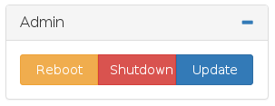

Click on on the `Update` button.  This will open a window allowing you to choose the new firmware.

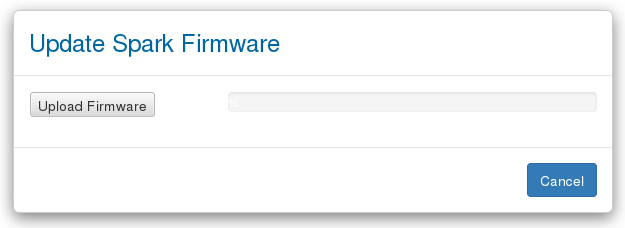

Click on the `Upload Firmware` button and choose the new Spark firmware `zip` file.  Wait for the upload to reach 100% then click the `Reboot Now` button.

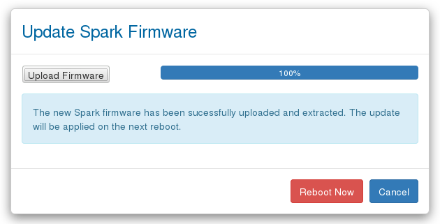

Once Spark has finished rebooting it will be running the new firmware.

## Update Micro SD Card or USB Dongle Directly
If it is not possible to use the Spark Web Admin to update Spark then an alternative method is to write the new firmware directly to the micro SD card or USB dongle used by Spark.

> **Note:** Before updating using this method you must have performed the [Initial Firmware Setup](#initial-firmware-setup) at least once.

To update follow these steps:
- Power off Spark.
- Remove the micro SD card or USB Dongle from Spark.
- Plug the micro SD card into a card reader and plug this into a PC.  If the Spark uses a USB Dongle then plug this into a PC.  Either a Windows 7 or Linux PC will work.
- Extract the Spark firmware zip file and copy all the contents to the micro SD Card or USB Dongle.
- Safely eject and remove the micro SD card or USB Dongle from the PC and plug in back into the Spark.
- Power the Spark back on.

Once Spark boots it will be running the new firmware.
